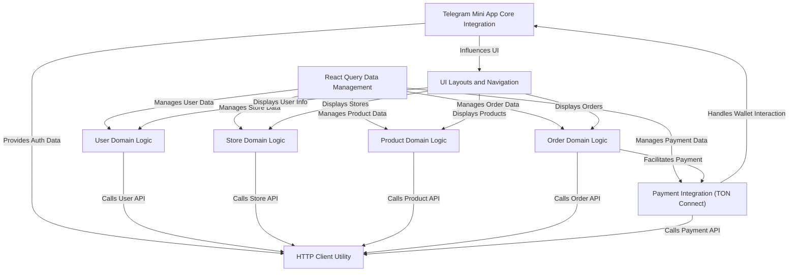

# Tutorial: telemora-web

Telemora is a **marketplace** application designed to run within Telegram Mini Apps.
It allows users to **create stores**, **list products**, place and manage **orders**,
and handle **payments**, including integration with the TON blockchain.
The app deeply integrates with the Telegram environment to provide a seamless user experience.

## Visual Overview

## Chapters

1. [Telegram Mini App Core Integration
   ](01_telegram_mini_app_core_integration_.md)
2. [User Domain Logic
   ](02_user_domain_logic_.md)
3. [Store Domain Logic
   ](03_store_domain_logic_.md)
4. [Product Domain Logic
   ](04_product_domain_logic_.md)
5. [Order Domain Logic
   ](05_order_domain_logic_.md)
6. [Payment Integration (TON Connect)
   ](06_payment_integration__ton_connect__.md)
7. [UI Layouts and Navigation
   ](07_ui_layouts_and_navigation_.md)
8. [React Query Data Management
   ](08_react_query_data_management_.md)
9. [HTTP Client Utility
   ](09_http_client_utility_.md)

---
