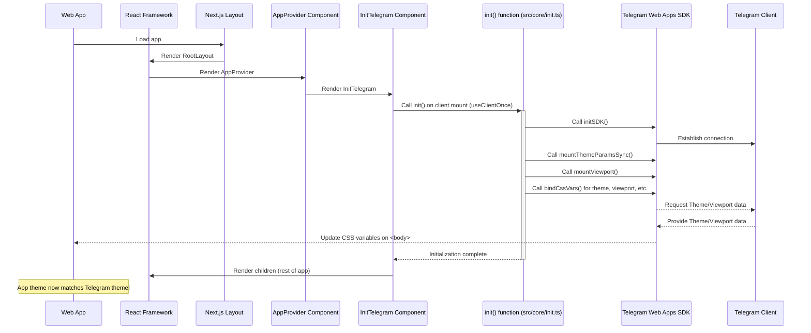

# Chapter 1: Telegram Mini App Core Integration

Welcome to the first chapter of the Telemora tutorial! We're starting our journey by understanding a crucial part of building a Telegram Mini App: how your web application talks to the Telegram environment it lives in.

Think of your web app running inside Telegram like a guest in someone's house. To be a good guest, you need to know the house rules and perhaps use some of the house's features (like turning on the light or knowing the temperature). The **Telegram Mini App Core Integration** is like the friendly guide or the special adapter that lets your web app communicate with Telegram's "house" – the Telegram client itself.

This integration handles the essential communication link. It uses something called the **Telegram Web Apps SDK** (Software Development Kit). The SDK is a collection of tools and functions provided by Telegram that your web app can use.

So, what kinds of cool things can this "bridge" or "adapter" do? Lots! It lets your app:

* Figure out who the user is (basic info).
* Know what color theme the user is using in Telegram and match it.
* Control how much space the app takes on the screen (viewport).
* Use native Telegram features like the 'Back' button or even make the phone vibrate (haptic feedback).

Let's look at a simple but very important use case: **making your web app look like a natural part of Telegram.**

When a user opens your Mini App, they expect it to blend in with their Telegram experience. This means using similar colors, fonts, and overall look and feel. Telegram provides theme information (like background color, text color, button color) to the Mini App. Our core integration's job is to get this information and apply it to our web app's design.

Without this integration, your app would look the same for everyone, regardless of their Telegram theme settings (like Dark mode, Light mode, etc.). That wouldn't be a great user experience!

## How it Works (High Level)

Our web app needs to know when it's running inside Telegram and then tell the Telegram Web Apps SDK to "initialize". Initializing means setting up the connection and getting the necessary information from Telegram.

Once initialized, the SDK makes Telegram's data available to our app. The core integration specifically focuses on getting the fundamental stuff ready, like:

* Setting up the main Mini App object (`miniApp`).
* Getting the theme colors (`themeParams`).
* Understanding the screen size and layout (`viewport`).
* Enabling the Telegram Back Button (`backButton`).

In the Telemora project, this initialization happens very early, as soon as the application starts.

## Setting up the Bridge: The Initialization Code

Let's see where this initialization happens in the code. The main logic is contained in a function called `init` in the file `src/core/init.ts`.

```typescript
// src/core/init.ts
import {
  init as initSDK, // Alias to avoid name clash
  miniApp,
  mountBackButton,
  mountMiniAppSync,
  mountThemeParamsSync,
  setDebug,
  themeParams,
  viewport,
} from '@telegram-apps/sdk-react';

export function init(debug: boolean): void {
  // Check if we are running in a browser environment
  if (typeof window === 'undefined') return;

  // Enable SDK debugging if needed
  setDebug(debug);

  // Initialize the main SDK connection
  initSDK();

  // Mount and sync various SDK components
  mountBackButton();
  mountMiniAppSync();
  mountThemeParamsSync();

  // ... rest of the initialization for viewport and binding CSS variables
  // (See full code snippet below)
}
```

This snippet shows the core `init` function. It first checks if we are in a browser environment (since Telegram Mini Apps run in webviews). Then, it calls `initSDK()`, which is the primary function to establish the connection with Telegram. After that, it calls several `mount...Sync()` and `mount...()` functions. These are like telling the SDK, "Hey, pay attention to the Back Button!", "Keep the Mini App properties updated!", and "Keep the Theme Parameters updated!".

The full `init` function also includes steps to bind Telegram's theme and viewport properties to CSS variables in our web app:

```typescript
// src/core/init.ts (Continuing the init function)
import {
  init as initSDK,
  initData, // Used for user data, covered later
  miniApp,
  mountBackButton,
  mountMiniAppSync,
  mountThemeParamsSync,
  setDebug,
  themeParams,
  viewport,
} from '@telegram-apps/sdk-react';

export function init(debug: boolean): void {
  if (typeof window === 'undefined') return;
  setDebug(debug);

  initSDK();

  mountBackButton();
  mountMiniAppSync();
  mountThemeParamsSync();
  // initData.restore(); // This is for user data, covered in next chapter!

  // Mount and bind viewport properties
  void viewport
    .mount() // Start listening to viewport changes
    .then(() => {
      if (!viewport.isCssVarsBound()) {
        viewport.bindCssVars(); // Bind viewport CSS variables
      }
    })
    .catch((e) => {
      console.error('Something went wrong mounting the viewport', e);
    });

  // Bind Mini App and Theme properties to CSS variables
  if (!miniApp.isCssVarsBound()) {
    miniApp.bindCssVars();
  }

  if (!themeParams.isCssVarsBound()) {
    themeParams.bindCssVars();
  }

  // Optional: Initialize debugging tools in development
  if (debug) {
    import('eruda').then((lib) => lib.default.init()).catch(console.error);
  }
}
```

The `bindCssVars()` calls are super important for our theme use case! They tell the SDK to take the theme colors it gets from Telegram (like the background color) and set them as CSS variables on the `<body>` element of our HTML page. These variables have special names like `--tg-theme-bg-color`, `--tg-theme-text-color`, etc.

## Where is `init` Called?

Now, where does this `init` function get called? It happens within a React component designed specifically for this early initialization.

Look at `src/libs/common/components/init-telegram.tsx`:

```typescript
// src/libs/common/components/init-telegram.tsx
'use client'; // Important for Next.js client components

import { useLaunchParams } from '@telegram-apps/sdk-react'; // Hook to get Telegram params
import { type PropsWithChildren } from 'react';

import { init } from '@/core/init'; // Our init function
import { ErrorBoundary } from '@/libs/common/components/ErrorBoundary'; // Handles errors
import SplashScreen from '@/libs/common/components/splash-screen'; // Shows loading
import { useClientOnce } from '@/libs/common/hooks/useClientOnce'; // Runs code only once on client
import { useDidMount } from '@/libs/common/hooks/useDidMount'; // Checks if component is mounted

import { isDev } from '../utils'; // Helper to check development mode

export default function InitTelegram({ children }: PropsWithChildren) {
  // UseTelegramMock is for development/testing outside Telegram, skip for now
  // UseTelegramMock(isDev);

  const didMount = useDidMount(); // Check if the component has rendered

  // Get launch parameters from Telegram (like startParam)
  const launchParams = useLaunchParams();

  // Determine debug mode based on environment or launch param
  const debug = isDev || launchParams?.startParam === 'debug';

  // Call our init function only once on the client side
  useClientOnce(() => {
    init(debug);
  });

  // Show a splash screen while mounting/initializing
  if (!didMount) {
    return <SplashScreen />;
  }

  // Render children once mounted, wrapped in an error boundary
  return <ErrorBoundary fallback={TelegramErrorPage}>{children}</ErrorBoundary>;
}

// TelegramErrorPage is a simple fallback UI if initialization fails
function TelegramErrorPage({
  error,
  reset,
}: {
  error?: Error & { digest?: string };
  reset?: () => void;
}) {
  console.warn(error);
  return (
    <main>
      <pre>it seems you do not use telegram env</pre>
      {/* Button to reset error, hidden for simplicity */}
      {/* <button onClick={reset}></button> */}
    </main>
  );
}
```

This component uses the `useClientOnce` hook to ensure that our `init(debug)` function is called only one time when the component mounts on the client-side (in the user's browser/webview). It also includes basic error handling and a splash screen while things are setting up.

## How it Fits into the App

The `InitTelegram` component is included very high up in the application's component tree. You can find it inside the `AppProvider` component in `src/providers/AppProvider.tsx`:

```typescript
// src/providers/AppProvider.tsx
'use client';

import dynamic from 'next/dynamic';
import { PropsWithChildren } from 'react';

// Import other providers used later in the tutorial
// import { QueryContext } from '@/libs/common/context/queryContext';
// import { UserProvider } from '@/libs/users/context/userContext';
// import TonConnectClientProvider from '@/providers/TonConnectClientProvider';

// Dynamically import InitTelegram, disabling Server-Side Rendering (SSR)
const InitTelegram = dynamic(() => import('@/libs/common/components/init-telegram'), {
  ssr: false, // This component only works in the browser
});

export function AppProvider({ children }: PropsWithChildren) {
  return (
    <>
      {/* InitTelegram is placed here so it runs early */}
      <InitTelegram>
        {/* Other providers for user data, payment, etc. wrap the rest of the app */}
        {/* <TonConnectClientProvider> */}
        {/*   <QueryContext> */}
        {/*     <UserProvider>{children}</UserProvider> */}
        {/*   </QueryContext> */}
        {/* </TonConnectClientProvider> */}
        {children} {/* The rest of your application */}
      </InitTelegram>
    </>
  );
}
```

The `AppProvider` component is a central place to wrap our entire application with various necessary providers and initialization steps. By placing `InitTelegram` inside `AppProvider`, we guarantee it runs before most of our app's other logic and UI components.

Finally, the `AppProvider` is used in the main application layout file, `src/app/layout.tsx`:

```typescript
// src/app/layout.tsx
import './globals.css'; // Global styles
import '@telegram-apps/telegram-ui/dist/styles.css'; // Styles for Telegram UI components

import type { Metadata } from 'next';
import type { PropsWithChildren } from 'react';

import { AppProvider } from '@/providers/AppProvider'; // Our AppProvider

export const metadata: Metadata = {
  title: 'Telemora',
  description: 'Telegram mini app',
  // ... other metadata
  manifest: '/manifest.json',
};

export default function RootLayout({ children }: PropsWithChildren) {
  return (
    <html lang="en" suppressHydrationWarning>
      {/* Body includes the AppProvider */}
      <body className="antialiased">
        <AppProvider>{children}</AppProvider> {/* AppProvider wraps everything */}
      </body>
    </html>
  );
}
```

This shows the complete flow: when the app loads, the `RootLayout` renders, which includes the `AppProvider`. The `AppProvider` then renders `InitTelegram`, which performs the essential SDK initialization by calling the `init` function from `src/core/init.ts`.

## How the Theme Use Case is Solved with CSS Variables

Remember our use case: matching the Telegram theme? The `bindCssVars()` calls in `src/core/init.ts` are the key. They make theme colors available as CSS variables.

Our project uses Tailwind CSS for styling. The `tailwind.config.ts` file is configured to read these very CSS variables for defining its color palette:

```typescript
// tailwind.config.ts
import { heroui } from '@heroui/theme';
import type { Config } from 'tailwindcss';

export default {
  content: [
    // ... file paths
  ],
  theme: {
    extend: {
      // ... other extensions
      colors: {
        // Mapping standard Tailwind colors to Telegram CSS variables
        background: 'var(--tg-theme-bg-color)',
        foreground: 'var(--tg-theme-text-color)',
        primary: 'var(--tg-theme-button-color)',
        'primary-text': 'var(--tg-theme-button-text-color)',
        secondary: 'var(--tg-theme-secondary-bg-color)',
        header: 'var(--tg-theme-header-bg-color)',
        accent: 'var(--tg-theme-accent-text-color)',
        link: 'var(--tg-theme-link-color)',
        hint: 'var(--tg-theme-hint-color)',
        subtitle: 'var(--tg-theme-subtitle-text-color)',
        destructive: 'var(--tg-theme-destructive-text-color)',
        section: {
          bg: 'var(--tg-theme-section-bg-color)',
          header: 'var(--tg-theme-section-header-text-color)',
          separator: 'var(--tg-theme-section-separator-color)',
        },
        bottomBar: 'var(--tg-theme-bottom-bar-bg-color)',
      },
      textColor: {
        DEFAULT: 'var(--tg-theme-text-color)',
        primary: 'var(--tg-theme-button-text-color)',
        // ... other text colors using CSS variables
      },
      backgroundColor: {
        DEFAULT: 'var(--tg-theme-bg-color)',
        primary: 'var(--tg-theme-button-color)',
        // ... other background colors using CSS variables
      },
      borderColor: {
        section: 'var(--tg-theme-section-separator-color)',
      },
      // ... rest of the config
    },
  },
  // ... rest of the config including heroui plugin which also uses these vars
} satisfies Config;
```

Because of this configuration, when Telegram changes the theme (e.g., user switches from Light to Dark mode), the SDK updates the CSS variables, and Tailwind automatically picks up these changes, restyling the entire application to match the new theme! This all happens thanks to the initial core integration.

## Conceptual Flow

Here's a simplified look at how the core integration initialization happens when the app starts:



This diagram shows that the process starts from the top-level layout, goes down through our provider and initialization components, triggers the core `init` function, which then uses the SDK to talk to Telegram and get the necessary information back, making it available to the web app (like through CSS variables).

## Conclusion

In this first chapter, we've learned that the **Telegram Mini App Core Integration** is the essential setup that allows our web app to communicate with the Telegram environment using the Telegram Web Apps SDK. We saw how the `init` function in `src/core/init.ts` is the heart of this process, called early in the app lifecycle via the `InitTelegram` component and `AppProvider`. We also explored a concrete use case – seamless theme integration – and understood how the SDK, our `init` function, CSS variables, and Tailwind CSS work together to achieve it.

This core integration lays the foundation for using all other Telegram-specific features. In the [next chapter](02_user_domain_logic_.md), we will build upon this foundation to understand how to handle **User Domain Logic**, specifically accessing user data provided by Telegram.

[Next Chapter: User Domain Logic](02_user_domain_logic_.md)

---
