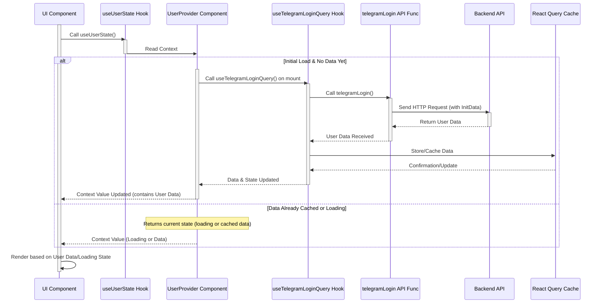

# Chapter 2: User Domain Logic

Welcome back to the Telemora tutorial! In [Chapter 1: Telegram Mini App Core Integration](01_telegram_mini_app_core_integration_.md), we learned how our web application connects and communicates with the Telegram environment. This foundation is essential, as it allows us to get information *from* Telegram, like the user's theme and, importantly, basic user details.

Now that our app can talk to Telegram, the very next crucial step for almost any application is knowing **who the user is**. This is where the **User Domain Logic** comes in.

Imagine your web application needs to display the logged-in user's name on their profile page or perhaps show their profile picture. To do this, your app needs a reliable way to:

1. Get the current user's information.
2. Store this information so any part of your app can access it easily.
3. Potentially update this information (like changing their language or profile details).
4. Define what user data looks like and validate any changes.

The **User Domain Logic** abstraction group is designed precisely for this. It's like having a dedicated system within your app just for managing everything about the user who is currently using it.

It handles:

* **Defining User Data:** What properties does a user have? (e.g., name, photo, ID).
* **Getting User Data:** How do we fetch the current user's profile, especially the one provided by Telegram?
* **Accessing User Data:** How can any component in our React app easily know who the current user is?
* **Updating User Data:** How do we send changes to the backend if the user updates their profile?
* **Validation:** Ensuring that any data we send to the backend (like updated profile info) is in the correct format.

Let's focus on the most common initial use case: **displaying the current logged-in user's profile information.**

## The Core Use Case: Getting and Displaying the User's Profile

When a user opens our Telegram Mini App, Telegram provides some initial data about them. Our app needs to take this data, potentially use it to identify the user on our backend server, fetch their full profile details, and then make this data available throughout the application.

This involves several pieces working together:

1. **Data Structure:** We need a definition of what a "User Profile" looks like in our code.
2. **API Call:** We need a function to communicate with our backend server to get the user's profile, using the initial data from Telegram.
3. **Data Fetching Hook:** We need an easy way for React components to trigger this API call and manage the loading/error states.
4. **Context:** We need a central place to store the fetched user data so *all* parts of our app can access it without passing it down manually through props.
5. **Access Hook:** A simple hook to read the user data from the central context.
6. **Component:** A React component that actually uses the access hook to display the data.

The User Domain Logic group bundles all these pieces together, typically within the `src/libs/users` directory.

## Defining the User Data (Types)

First, let's look at how we define what user data looks like. This is done using TypeScript interfaces in `src/libs/users/types/index.ts`.

```typescript
// src/libs/users/types/index.ts (Simplified)

// Basic info like ID and username
export interface UserPublicPreview {
  id: number | string;
  username?: string;
  handle?: string;
  photo?: { url: string }; // Simplified Media type
}

// More detailed summary, includes name and role
export interface UserSummary extends UserPublicPreview {
  firstName: string;
  lastName?: string;
  role: 'buyer' | 'seller' | 'both'; // Simplified UserRole enum
  // ... other summary fields
}

// The full private profile we get from the backend
export interface UserPrivateProfile extends UserSummary {
  telegramId: string;
  phoneNumber?: string;
  email?: string;
  walletAddress?: string;
  // ... potentially lists of stores, orders, etc.
  // ... currency info
}

// ... other interfaces for DTOs (Data Transfer Objects)
```

This code defines the shape of our user data. `UserPublicPreview` is minimal, `UserSummary` adds more common details, and `UserPrivateProfile` contains everything, including sensitive or private information retrieved from our backend. These types ensure we know exactly what data to expect when we fetch user information.

## Fetching User Data from the Backend (API)

When the Telegram Mini App launches, Telegram gives us `initData` (initialization data). This data contains information about the user and is cryptographically signed by Telegram, making it trustworthy. Our backend needs this `initData` to verify the user and fetch their full profile from its database.

The API function responsible for this "login" process (where our app identifies itself and gets the user's profile) is located in `src/libs/users/api/index.ts`.

```typescript
// src/libs/users/api/index.ts (Simplified)
import httpClient from '@/libs/common/utils/http-client'; // Our tool for making HTTP requests
import {generateMockUserPrivateProfile} from '@/libs/users/mocks'; // Mock data for development
import {UserPrivateProfile} from '@/libs/users/types';

// Function to call our backend's login endpoint
export async function telegramLogin() {
  // Check if we are in development mode
  return process.env.NODE_ENV === 'development'
    // If in dev, return mock data
    ? generateMockUserPrivateProfile()
    // If not in dev, make a real HTTP GET request
    // httpClient automatically includes initData in headers
    : httpClient.get<UserPrivateProfile>('/users/login');
}

// ... other API functions for updating profile, language, etc.
```

The `telegramLogin` function is straightforward. It uses our `httpClient` utility (which we'll learn more about in [Chapter 9: HTTP Client Utility](09_http_client_utility_.md)) to make a `GET` request to the `/users/login` endpoint on our backend. Crucially, `httpClient` is set up to automatically send the `initData` provided by Telegram with every request (this happens as part of the core setup, not shown here).

The backend receives the `initData`, verifies its signature with Telegram's servers, identifies the user based on the Telegram ID in the data, and then returns the `UserPrivateProfile` for that user from its own database.

For development, it includes a check (`process.env.NODE_ENV === 'development'`) to return mock data, so we don't need a running backend just to build the UI.

## Making Data Fetching Easy (React Query Hook)

Directly calling the `telegramLogin` API function in a component means dealing with loading states, errors, and re-fetching manually. This is repetitive. The project uses React Query (covered in detail in [Chapter 8: React Query Data Management](08_react_query_data_management_.md)) to handle this complexity gracefully.

A custom hook `useTelegramLoginQuery` is created in `src/libs/users/hooks/index.ts` to wrap the API call.

```typescript
// src/libs/users/hooks/index.ts (Simplified)
import {useQuery} from '@tanstack/react-query'; // React Query hook
import {telegramLogin} from '@/libs/users/api'; // Our API function

// Custom hook to fetch the current user's profile
export function useTelegramLoginQuery() {
  return useQuery({
    queryKey: ['me'], // Unique key for React Query to identify this data
    queryFn: telegramLogin, // The function that fetches the data
    staleTime: 1000 * 60 * 5, // Data is considered fresh for 5 minutes
    retry: false, // Don't retry if the login fails initially
  });
}

// ... other mutation hooks for updates
```

The `useTelegramLoginQuery` hook uses React Query's `useQuery`. When a component calls this hook, React Query will automatically:

* Call the `telegramLogin` function the first time the hook is used.
* Manage the loading state (`isLoading`).
* Manage any errors (`error`).
* Store the fetched data (`data`) in a cache.
* Return the cached data quickly if the hook is used again elsewhere, without re-fetching if the data is still `staleTime`.

This hook gives us a clean interface to fetch the user data.

## Providing Data Globally (React Context)

Now that we have a hook to fetch the user data, we need to make it easily accessible to *any* component in the application. Passing the user data down through props (`<Component user={userData} />`) can quickly become cumbersome in a large application (this is known as "prop drilling").

React Context is the perfect solution for this. It allows us to provide data at a high level in the component tree and consume it anywhere below.

The `UserProvider` component and `useUserState` hook in `src/libs/users/context/userContext.tsx` create this context.

```typescript
// src/libs/users/context/userContext.tsx (Simplified)
'use client'; // Marks this for client-side rendering in Next.js

import React, {createContext, type PropsWithChildren, useContext} from 'react';
import {useTelegramLoginQuery} from '@/libs/users/hooks'; // Our fetching hook
import {UserPrivateProfile} from '@/libs/users/types'; // User data type

// Define the shape of the context value
interface UserContextValue {
  data?: UserPrivateProfile; // The user data (optional while loading/errored)
  isLoading: boolean; // Loading state
}

// Create the context with a default undefined value
const UserContext = createContext<UserContextValue | undefined>(undefined);

// Provider component that fetches data and makes it available
export function UserProvider({children}: PropsWithChildren) {
  const {data, isLoading, error} = useTelegramLoginQuery(); // Fetch data using the hook

  // Basic handling: If error or no data, maybe don't render children
  // In a real app, you might show an error page or login screen
  if (error) {
    console.error('Failed to load user:', error);
    return null; // Or render an error UI
  }

  if (isLoading) {
    // You could render a loading spinner here
    return null; // Or render a loading UI
  }

  if (!data) {
    // Should not happen if isLoading is false, but good practice
    return null; // Or render an error UI
  }

  // Provide the fetched data and loading state to the context
  return (
    <UserContext.Provider value = {
  {
    data, isLoading
  }
}>
  {
    children
  }
  {/* Render the rest of the app */
  }
  </UserContext.Provider>
)
  ;
}

// Hook to consume the context value
export const useUserState = () => {
  const context = useContext(UserContext);
  // Throw an error if hook is used outside the Provider
  if (!context) throw new Error('useUserState must be used within <UserProvider>');
  return context;
};
```

The `UserProvider` component is designed to wrap a part of our application. When it mounts, it calls `useTelegramLoginQuery` to start fetching the user data. It then provides the result (`data`, `isLoading`) through the `UserContext.Provider`.

The `useUserState` hook is a simple wrapper around `useContext(UserContext)`. Any component that needs access to the current user's data can simply call `const { data: user, isLoading } = useUserState();`. This makes accessing user data extremely convenient throughout the app.

As seen in [Chapter 1](01_telegram_mini_app_core_integration_.md), the `UserProvider` is placed high up in the component tree within the `AppProvider` (`src/providers/AppProvider.tsx`) to ensure it wraps most of the application.

```typescript
// src/providers/AppProvider.tsx (Snippet showing UserProvider placement)
'use client';

import dynamic from 'next/dynamic';
import {PropsWithChildren} from 'react';

const InitTelegram = dynamic(() => import('@/libs/common/components/init-telegram'), {
  ssr: false,
});

// Import other providers like UserProvider
import {UserProvider} from '@/libs/users/context/userContext';

// ... other imports

export function AppProvider({children}: PropsWithChildren) {
  return (
    <>
      <InitTelegram>
        {/* ... other providers */}
  {/* UserProvider wraps the application content */
  }
  <UserProvider>
    {children}
  {/* The rest of your application */
  }
  </UserProvider>
  {/* ... other providers */
  }
  </InitTelegram>
  < />
)
  ;
}
```

By placing `UserProvider` here, we guarantee that any component rendered inside `AppProvider` (which is most of our application) can use `useUserState` to access the current user's data.

## Displaying User Data (Component)

Now that the user data is easily available via `useUserState`, displaying it in a component is simple. Let's look at the `ProfileCard` component in `src/libs/users/components/profile-card.tsx`. While this component receives the `user` data as a prop in the provided snippet, in a real scenario where it needs the *current* user, it would often use the context hook. Let's imagine a version that uses the hook:

```typescript
// src/libs/users/components/profile-card-with-hook.tsx (Conceptual Example)
'use client';

import Image from 'next/image';
import {useUserState} from '@/libs/users/context/userContext'; // Import the hook

export default function ProfileCard() {
  const {data: user, isLoading} = useUserState(); // Get user data from context

  // Handle loading state
  if (isLoading) {
    return <div>Loading
    profile
  ...
    </div>;
  }

  // Handle case where user data might not be available (e.g., error or not logged in)
  if (!user) {
    return <div>Could
    not
    load
    profile. < /div>; /
    / Or redirect to login
  }

  // Now use the user data to render the profile
  return (
    <div className = "space-y-2" >
    <div className = "text-center" >
    <Image
      src = {user.photo?.url ?? '/default-profile.png'}
  alt = "user photo"
  width = {128}
  height = {128}
  className = "inline-block aspect-square w-32 rounded-full object-cover"
  / >
  <div className = "mt-4" >
  <h2 className = "text-lg font-semibold" >
    {user.firstName}
  {
    user.lastName
  }
  </h2>
  {
    user.username && <p className = "text-sm lowercase text-gray-500" > @{user.username} < /p>}
      < /div>
      < /div>
    {/* ... other profile details and buttons */
    }
    </div>
  )
    ;
  }
```

This simplified example shows how the component uses `useUserState` to get the `user` object and `isLoading` state, handle the loading state, and then render the user's name and photo. This component doesn't need to know *how* the data was fetched, only that it can access it via the hook.

## Conceptual Flow: Getting User Data

Here's a simplified flow showing how a component gets user data using the domain logic:



This diagram illustrates that a UI component uses `useUserState` which reads from the `UserProvider`'s context. The `UserProvider`, when it first mounts, triggers the data fetching via `useTelegramLoginQuery`. This hook calls the `telegramLogin` API function, which communicates with the backend. The fetched data is stored by React Query, and the `UserProvider`'s context is updated, causing components using `useUserState` to re-render with the new data.

## Updating User Data (Mutations)

Besides fetching, the User Domain Logic also handles updating user information. This follows a similar pattern using React Query **mutations**.

Schemas (`src/libs/users/schemas/index.ts`) are used to define the structure and validation rules for data being sent for updates, typically using the `zod` library.

```typescript
// src/libs/users/schemas/index.ts (Simplified)
import {z} from 'zod';

// Schema for updating the user's first and last name
export const updateProfileSchema = z.object({
  firstName: z.string().min(1, 'First name is required').optional(),
  lastName: z.string().min(1, 'Last name is required').optional(),
});

// Schema for updating language
export const updateLanguageSchema = z.object({
  languageCode: z.string().min(2, 'Language code is required'),
});

// ... other schemas
```

API functions (`src/libs/users/api/index.ts`) handle sending the update requests to the backend.

```typescript
// src/libs/users/api/index.ts (Simplified)
import httpClient from '@/libs/common/utils/http-client';
import {generateMockUserPrivateProfile} from '@/libs/users/mocks'; // Mock data
import {
  UpdateLanguageDto,
  UpdateProfileDto,
  UserPrivateProfile,
} from '@/libs/users/types';

export async function updateProfile(telegramId: number | string, data: UpdateProfileDto) {
  return process.env.NODE_ENV === 'development'
    ? generateMockUserPrivateProfile()
    // PATCH request to update specific fields
    : httpClient.patch<UserPrivateProfile>(`/users/profile/${telegramId}`, data);
}

export async function updateLanguage(telegramId: number | string, data: UpdateLanguageDto) {
  return process.env.NODE_ENV === 'development'
    ? generateMockUserPrivateProfile()
    : httpClient.patch<UserPrivateProfile>(`/users/language/${telegramId}`, data);
}

// ... other update functions
```

React Query mutation hooks (`src/libs/users/hooks/index.ts`) wrap these API functions to handle sending data, loading states, and success/error responses.

```typescript
// src/libs/users/hooks/index.ts (Simplified)
import {useMutation} from '@tanstack/react-query';
import {updateLanguage, updateProfile} from '@/libs/users/api';
import {UpdateLanguageFormData, UpdateProfileFormData} from '@/libs/users/schemas';

export function useUpdateProfileMutation() {
  return useMutation({
    mutationFn: ({
                   telegramId,
                   data,
                 }: {
      telegramId: number | string;
      data: UpdateProfileFormData;
    }) => updateProfile(telegramId, data),
    // Optional: onSuccess, onError handlers
  });
}

export function useUpdateLanguageMutation() {
  return useMutation({
    mutationFn: ({
                   telegramId,
                   data,
                 }: {
      telegramId: number | string;
      data: UpdateLanguageFormData;
    }) => updateLanguage(telegramId, data),
    // Optional: onSuccess, onError handlers
    // Often, onSuccess will invalidate or update the 'me' query cache
    // so that the useTelegramLoginQuery hook gets the fresh data.
  });
}

// ... other mutation hooks
```

Finally, components like the `LanguageSelector` in `src/libs/users/components/language-selector.tsx` use forms (with schema validation) and these mutation hooks to allow users to update their data.

```typescript
// src/libs/users/components/language-selector.tsx (Simplified)
'use client';

import {Button, Form, Select, SelectItem} from '@heroui/react'; // UI components
import {zodResolver} from '@hookform/resolvers/zod'; // For form validation
import {Controller, useForm} from 'react-hook-form'; // For form management
import toast from 'react-hot-toast'; // For notifications

import {useUpdateLanguageMutation} from '@/libs/users/hooks'; // Our update hook
import {UpdateLanguageFormData, updateLanguageSchema} from '@/libs/users/schemas'; // Schema for validation

// ... component props

export default function LanguageSelector({telegramId, onClose, defaultLanguage = 'en'}) {
  const {mutateAsync, isPending} = useUpdateLanguageMutation(); // Get the mutation function and state

  const {
    control,
    handleSubmit,
    formState: {errors},
  } = useForm<UpdateLanguageFormData>({
    resolver: zodResolver(updateLanguageSchema), // Use zod for validation
    defaultValues: {
      languageCode: defaultLanguage,
    },
  });

  const onSubmit = async (formData: UpdateLanguageFormData) => {
    try {
      await mutateAsync({telegramId, data: formData}); // Call the mutation
      toast.success('Language updated successfully');
      onClose?.(); // Close the form on success
    } catch {
      toast.error('Failed to update language');
    }
  };

  return (
    <Form onSubmit = {handleSubmit(onSubmit)} > {/* Use handleSubmit to trigger onSubmit */}
  {/* ... Form fields using Controller with Select */
  }
  <Controller
    name = "languageCode"
  control = {control}
  render = {({field})
=>
  (
    <Select
      label = "Language"
      // ... bind Select props to field
      >
      {/* ... SelectItem options */}
      < /Select>
  )
}
  />

  < div
  className = "mt-6 flex justify-end gap-x-4" >
  <Button type = "submit"
  isDisabled = {isPending}
  isLoading = {isPending} > {/* Disable button while pending */}
  Save
  < /Button>
  < /div>
  < /Form>
)
  ;
}
```

This example shows how the component uses `react-hook-form` with `zod` for validation and `useUpdateLanguageMutation` to send the updated language code to the backend when the form is submitted.

## Conclusion

In this chapter, we explored the **User Domain Logic**, understanding that it's a collection of code responsible for managing everything related to the user in our application. We saw how it defines the structure of user data using **types**, handles fetching the current user's profile from the backend via **API functions** and **React Query hooks**, and makes this data easily accessible throughout the app using a **React Context** and a custom access **hook** (`useUserState`). We also briefly touched upon how it handles data **validation** using **schemas** and updates using **mutation hooks**.

This dedicated domain logic provides a clean, centralized way to interact with user data, keeping related concerns organized and making it easy for any part of the application to know about and interact with the current user.

Building on our ability to identify and manage the user, the next logical step is to explore the products they might be interested in. In the [next chapter](03_store_domain_logic_.md), we will dive into the **Store Domain Logic**.

[Next Chapter: Store Domain Logic](03_store_domain_logic_.md)

---
