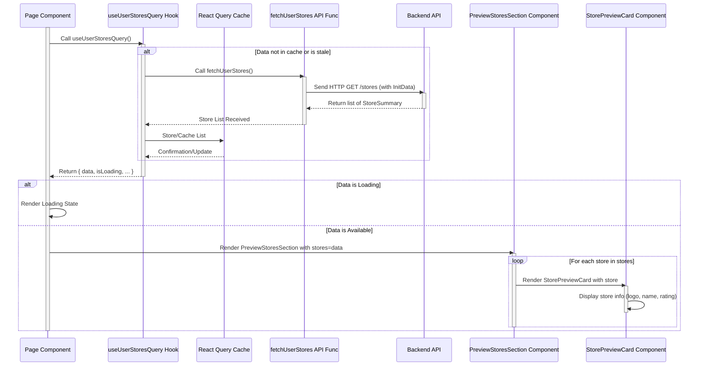

# Chapter 3: Store Domain Logic

Welcome back to the Telemora tutorial! In the previous chapters, we laid the groundwork by integrating with the Telegram environment ([Chapter 1: Telegram Mini App Core Integration](01_telegram_mini_app_core_integration_.md)) and understanding how to manage information about the user ([Chapter 2: User Domain Logic](02_user_domain_logic_.md)).

Now that we know *who* is using the app, we need to introduce the concept of **stores**. Telemora is a marketplace, and marketplaces have sellers who own shops or "stores". This chapter is all about the **Store Domain Logic**, the dedicated part of our codebase that handles everything related to these stores.

Think of the Store Domain Logic as the central hub for managing all information and actions related to seller shops. Just like the User Domain Logic manages user profiles, this system manages "store profiles."

What kind of things does it handle?

* Defining what a store looks like (its name, description, location, owner, etc.).
* Getting lists of stores (like stores owned by the current user or featured stores).
* Viewing detailed information about a specific store.
* Creating new stores.
* Updating existing store information (like address, working hours, logo).
* Validating the data when creating or updating a store.

A core use case we'll focus on is **displaying a list of the current user's stores** and showing a **preview or summary** of each store.

## The Core Use Case: Displaying User Stores

Imagine a user who is also a seller. They need a page in the app to see all the stores they own. This page should display basic information (like the name and logo) for each store.

To make this happen, our application needs to:

1. Know what kind of data represents a store (specifically, a simplified version for a list/preview).
2. Call the backend API to get the list of stores belonging to the current user.
3. Use a React Query hook to manage the fetching, loading, and error states.
4. Use a reusable React component to display each store item in the list.

The Store Domain Logic bundles all these pieces together, primarily within the `src/libs/stores` directory.

## Defining Store Data (Types)

Just like with users, we need to define the shape of our store data. This is done using TypeScript interfaces in `src/libs/stores/types/index.ts`. We have different types for different levels of detail: `StorePreview`, `StoreSummary`, and `StoreDetail`.

```typescript
// src/libs/stores/types/index.ts (Simplified)

// Basic info for lists or small previews
export interface StorePreview {
  id: number | string;
  name: string;
  slug?: string;
  logo?: { url: string }; // Simplified Media type
  reputation: number;
  isActive: boolean;
  // ... etc.
}

// More detail for summary views (e.g., on a listing page)
export interface StoreSummary extends StorePreview {
  tags?: string[];
  address: any; // Simplified, real type is Address
  description?: string;
  // ... etc.
}

// Full details for a specific store's page
export interface StoreDetail extends StoreSummary {
  owner: any; // Simplified, real type is UserSummary
  contactNumber?: string;
  email?: string;
  // ... includes products list, working hours, etc.
}
```

These types help us understand exactly what data we're working with at different points in the application. `StorePreview` is great for displaying many stores in a small space (like a horizontal list), while `StoreSummary` provides a bit more detail for a list view, and `StoreDetail` has everything for a single store's page.

## Fetching Store Data (API)

To get the list of stores for the current user, we need to call our backend API. The API functions for stores are defined in `src/libs/stores/api/index.ts`.

```typescript
// src/libs/stores/api/index.ts (Simplified)
import httpClient from '@/libs/common/utils/http-client'; // Our HTTP tool
import {generateMockStoreSummaries} from '@/libs/stores/mocks'; // Mock data
import {StoreSummary} from '@/libs/stores/types';
import {isDev} from '../../common/utils'; // Helper for dev mode

// Function to fetch the list of stores owned by the current user
export async function fetchUserStores() {
  // In development, return mock data. Otherwise, make a real API call.
  return isDev
    ? generateMockStoreSummaries()
    : httpClient.get<StoreSummary[]>('/stores'); // GET request to /stores
}

// Function to fetch details for a specific store by its ID
export async function fetchStoreDetails(storeId: string) {
  // In development, return mock data. Otherwise, make a real API call.
  return isDev
    ? generateMockStoreDetail() // Needs mock detail data import
    : httpClient.get<StoreDetail>(`/stores/${storeId}`); // GET request to /stores/:storeId
}

// ... other API functions for fetching discoverable, featured stores, etc.
```

The `fetchUserStores` function uses our `httpClient` utility ([Chapter 9: HTTP Client Utility](09_http_client_utility_.md)) to make a `GET` request to the `/stores` endpoint. Our backend is designed to return the stores owned by the user associated with the `initData` sent with the request (remember `httpClient` sends this automatically, as mentioned in [Chapter 2: User Domain Logic](02_user_domain_logic_.md)).

There's also a function `fetchStoreDetails` to get the full information for one specific store, and others for different lists of stores.

## Making Data Fetching Easy (React Query Hook)

To use these API functions in React components while easily handling loading states, errors, and caching, we use React Query hooks. These hooks are defined in `src/libs/stores/hooks/index.ts`.

```typescript
// src/libs/stores/hooks/index.ts (Simplified)
import {useQuery} from '@tanstack/react-query'; // React Query hook
import {fetchUserStores} from '@/libs/stores/api'; // Our API function
import {StoreSummary} from '@/libs/stores/types'; // Store data type

// Custom hook to fetch the current user's stores
export function useUserStoresQuery() {
  return useQuery<StoreSummary[]>({
    // Unique key for React Query to identify this data query
    queryKey: ['stores', 'my'],
    // The function that fetches the data
    queryFn: fetchUserStores,
    // ... other configuration like staleTime, retry
  });
}

// Custom hook to fetch details for a specific store
export function useStoreDetailsQuery(storeId: string) {
  return useQuery<StoreDetail>({
    queryKey: ['stores', 'detail', storeId], // Key includes the storeId
    queryFn: () => fetchStoreDetails(storeId), // Call the API function with storeId
    // This query will refetch if storeId changes
    enabled: !!storeId, // Only run the query if storeId is provided
  });
}

// ... other fetching and mutation hooks
```

The `useUserStoresQuery` hook wraps `fetchUserStores`. When called in a component, React Query will automatically execute `fetchUserStores`, manage the loading (`isLoading`), error (`isError`), and data (`data`) states. It also caches the results so if another part of the app needs the same data, it can get it instantly from the cache (until the data becomes "stale").

The `useStoreDetailsQuery` hook works similarly but takes a `storeId` parameter. React Query uses this `storeId` as part of the `queryKey`, meaning it caches details *per store*.

These hooks provide a simple and powerful way for components to access store data without worrying about the underlying fetching logic. You can learn more about React Query in [Chapter 8: React Query Data Management](08_react_query_data_management_.md).

## Displaying Store Data (UI Components)

Now that we can easily fetch lists or details of stores using the hooks, we need components to display this data. The Store Domain Logic includes reusable UI components in `src/libs/stores/components`.

Look at `src/libs/stores/components/preview-card.tsx`:

```typescript
// src/libs/stores/components/preview-card.tsx (Simplified)
import {Card, CardBody} from '@heroui/react'; // Basic UI components
import Image from 'next/image';
import Link from 'next/link';
import React from 'react';
import StarRating from '@/libs/common/components/star-rating'; // Rating component
import {StorePreview} from '@/libs/stores/types'; // Store data type

// Component to display a compact store preview
export const StorePreviewCard = ({store}: { store: StorePreview }) => {
  return (
    // Link makes the card clickable, navigating to the store's page
    <Link href = {`/stores/${store.id}`
}
  className = "block"
  passHref >
  <Card>{/* Basic Card structure */}
  < CardBody
  className = "flex flex-col items-center space-y-2 text-center" >
    {/* Display the store logo */}
    < Image
  src = {store.logo?.url ?? '/fallback-store.png'}
  alt = {store.name}
  width = {64}
  height = {64}
  className = "h-16 w-16 rounded-full object-cover"
  / >
  <div className = "w-full" >
    {/* Display the store name */}
    < h3
  className = "truncate text-sm font-medium" > {store.name} < /h3>
  {/* Display the store rating */
  }
  <StarRating rating = {store.reputation}
  />
  < /div>
  < /CardBody>
  < /Card>
  < /Link>
)
  ;
};
```

This `StorePreviewCard` component is designed to be simple. It takes a `StorePreview` object as a prop and displays its key information: logo, name, and reputation rating. It's wrapped in a `Link` so clicking it navigates to the detailed page for that store (`/stores/:storeId`).

There's also a `StoreSummaryCard` (`src/libs/stores/components/summary-card.tsx`) which displays slightly more information, suitable for a different list layout.

These components are then used by pages or other components that need to display lists of stores. For example, `src/libs/stores/components/preview-stores-section.tsx` might use the `StorePreviewCard`:

```typescript
// src/libs/stores/components/preview-stores-section.tsx (Simplified)
import {Button, Divider} from '@heroui/react';
import React from 'react';
import {StorePreviewCard} from '@/libs/stores/components/preview-card';
import {StorePreview} from '@/libs/stores/types';

// Component to display a section with a list of store preview cards
export default function PreviewStoresSection({
                                               stores, // Receives a list of StorePreview objects
                                               title,
                                             }: {
  stores: StorePreview[];
  title: string;
}) {
  return (
    <section className = "space-y-4" >
      <h1>{title} < /h1>
      < div
  className = "grid grid-cols-2 gap-3" >
    {/* Map over the list of stores */}
  {
    stores.length === 0 ? (
      // Show a button to create a store if the list is empty
      <Button as = {'link'} href = "/stores/create" >
      Create
    your
    first
    Store
    < /Button>
  ) :
    stores.map((store) => (
      // Render a StorePreviewCard for each store
      <StorePreviewCard key = {store.id}
    store = {store}
    />
  ))
  }
  </div>
  < /section>
)
  ;
}
```

This `PreviewStoresSection` component takes a list of `StorePreview` objects and renders a `StorePreviewCard` for each one. A page component could use the `useUserStoresQuery` hook to get the user's stores and then pass the result (`data`) to this section component.

## Conceptual Flow: Displaying User Stores

Here's how the pieces fit together when a page wants to display the current user's stores:



This diagram shows that the Page component uses `useUserStoresQuery`. React Query handles calling the `fetchUserStores` API function (which talks to the Backend). Once data is returned, React Query caches it and provides it to the hook. The Page component receives the data and passes it down to the `PreviewStoresSection`, which then renders multiple `StorePreviewCard` components to display the list.

## Creating and Updating Stores (Schemas and Mutations)

The Store Domain Logic also includes functionality for sellers to create new stores or update their existing ones. This involves:

1. **Schemas:** Defining the structure and validation rules for the data being sent, typically using `zod`. These are in `src/libs/stores/schemas/index.ts`.
2. **API Functions:** Sending the data to the backend using `httpClient.post` (for creating) or `httpClient.patch` (for updating). These are in `src/libs/stores/api/index.ts`.
3. **React Query Hooks (Mutations):** Wrapping the API calls with `useMutation` hooks to manage the process of sending data, tracking progress, and handling results. These are in `src/libs/stores/hooks/index.ts`.

Let's look at a simplified example for creating a store's basic info:

**Schema (`src/libs/stores/schemas/index.ts`):**

```typescript
// src/libs/stores/schemas/index.ts (Simplified)
import {z} from 'zod';

// Schema for the basic information when creating a store
export const storeBasicFormSchema = z.object({
  name: z.string().min(2, 'Store name is required'), // Name is required, min 2 chars
  description: z.string().optional(), // Description is optional
  walletAddress: z.string().min(10, 'Wallet address is required'), // Wallet is required
  // ... other fields
});

// Define the TypeScript type based on the schema
export type CreateStoreBasicDto = z.infer<typeof storeBasicFormSchema>;
```

This schema ensures that when someone submits the basic store form, the data (`name`, `walletAddress`, etc.) meets the defined requirements before it's sent to the backend.

**API Function (`src/libs/stores/api/index.ts`):**

```typescript
// src/libs/stores/api/index.ts (Simplified)
import httpClient from '@/libs/common/utils/http-client';
import {generateMockStoreDetail} from '@/libs/stores/mocks'; // Mock data
import {CreateStoreBasicDto} from '@/libs/stores/schemas';
import {StoreDetail} from '@/libs/stores/types';
import {isDev} from '../../common/utils';

// Function to send basic store info to the backend for creation
export async function submitStoreBasicInfo(data: CreateStoreBasicDto) {
  return isDev
    ? generateMockStoreDetail() // Return mock data in dev
    : httpClient.post<StoreDetail>('/stores/create/basic', data); // POST request
}
```

This function takes the validated data (`CreateStoreBasicDto`) and sends it via a `POST` request to the backend endpoint specifically for creating the basic store info.

**React Query Hook (`src/libs/stores/hooks/index.ts`):**

```typescript
// src/libs/stores/hooks/index.ts (Simplified)
import {useMutation, useQueryClient} from '@tanstack/react-query'; // React Query hooks
import {submitStoreBasicInfo} from '@/libs/stores/api'; // Our API function
import {CreateStoreBasicDto} from '@/libs/stores/schemas';
import {StoreDetail} from '@/libs/stores/types'; // Return type

export function useSubmitStoreBasicInfoMutation() {
  const queryClient = useQueryClient(); // To interact with the query cache

  // Hook for submitting basic store info
  return useMutation<StoreDetail, Error, CreateStoreBasicDto>({
    mutationFn: (data) => submitStoreBasicInfo(data), // The API function to call
    onSuccess: async (newStore) => {
      // On successful creation, we might want to refetch the user's stores list
      // so the new store appears automatically.
      await queryClient.prefetchQuery({queryKey: ['stores', 'my']});

      // Or you could update the cache manually:
      // queryClient.setQueryData(['stores', 'my'], (oldStores) => [...oldStores, newStore]);
    },
    // ... other options like onError
  });
}
```

The `useSubmitStoreBasicInfoMutation` hook wraps the `submitStoreBasicInfo` API function. A component can call `const mutation = useSubmitStoreBasicInfoMutation();` and then trigger the creation by calling `mutation.mutate(formData)`. The hook provides `isPending` (true while sending), `isError`, `error`, and `data` (the response from the backend). The `onSuccess` function is a common place to update the React Query cache, for example, by automatically refetching the user's list of stores (`queryKey: ['stores', 'my']`) so the UI shows the newly created store.

Similar patterns exist for updating store addresses, tags, working hours, and logos using `PATCH` requests and specific mutation hooks.

## Conclusion

In this chapter, we explored the **Store Domain Logic**, understanding that it's the dedicated system for managing all aspects of stores within the Telemora marketplace. We learned how it defines the structure of store data using **types**, handles fetching various lists of stores or individual store details via **API functions** and **React Query hooks**, and uses reusable **UI components** to display this data. We also touched upon how it handles **creating and updating** stores using **schemas** for validation, specific **API functions**, and **React Query mutation hooks**.

This domain logic centralizes store-related code, making it easier to understand, maintain, and build features like a seller dashboard or store listing pages.

Now that we can manage stores, the next logical step is to look at the items sold within those stores. In the [next chapter](04_product_domain_logic_.md), we will dive into the **Product Domain Logic**.

[Next Chapter: Product Domain Logic](04_product_domain_logic_.md)

---
