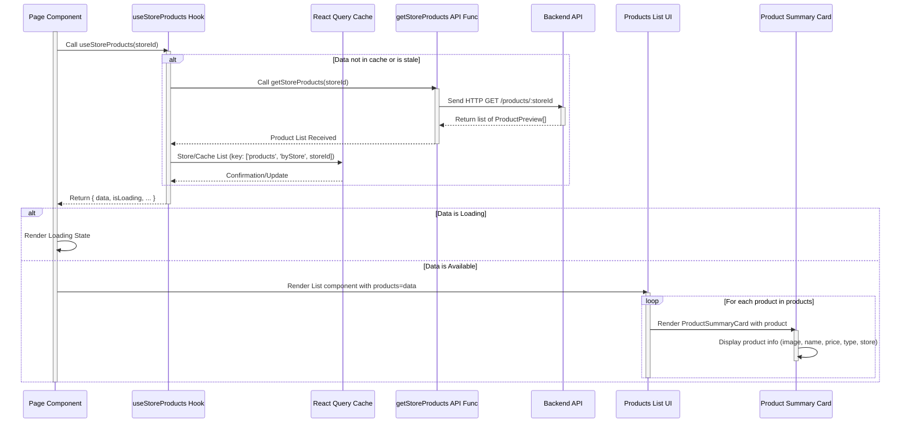

# Chapter 4: Product Domain Logic

Welcome back to the Telemora tutorial! In the previous chapters, we learned how to connect our app to the Telegram environment ([Chapter 1: Telegram Mini App Core Integration](01_telegram_mini_app_core_integration_.md)), manage user information ([Chapter 2: User Domain Logic](02_user_domain_logic_.md)), and handle seller stores ([Chapter 3: Store Domain Logic](03_store_domain_logic_.md)).

Now that we have stores, the next essential part of any marketplace is the items being sold within those stores – the **products**! This chapter introduces the **Product Domain Logic**, the dedicated system within our application responsible for everything related to the products listed in the marketplace.

Think of the Product Domain Logic as the application's catalog and inventory system. It manages all the details about individual items available for purchase.

What does this system handle?

* Defining what information makes up a product (like its name, price, description, photos, variations, stock).
* Validating product details when they are created or updated.
* Fetching lists of products (e.g., products in a specific store, featured products, search results).
* Getting detailed information for a single product.
* Creating new products.
* Updating existing products.
* Managing product photos (uploading, associating).
* Providing easy ways for React components to access and interact with product data.
* Offering reusable UI components to display products in different formats.

A primary use case we will explore is **displaying a list of products from a specific store**, perhaps showing a simple preview or summary of each product.

## The Core Use Case: Displaying Products in a Store

Imagine a user browsing our marketplace and clicking on a specific store. They will expect to see a list of all the products that store offers. This list should show essential information like the product's photo, name, and price.

To make this happen, our application needs to:

1. Define the different ways we represent product data (e.g., a minimal preview for lists, full details for a product page).
2. Call the backend API to fetch the list of products belonging to the store the user is currently viewing.
3. Use a React Query hook to manage the fetching process, including loading, errors, and caching.
4. Use reusable React components to display each product item in the list.

The Product Domain Logic group organizes all these related pieces, typically within the `src/libs/products` directory.

## Defining Product Data (Types)

First, we need to define the structure of product data using TypeScript interfaces. This helps keep our data consistent and predictable. Different levels of detail are needed for different purposes (`ProductPreview`, `ProductSummary`, `ProductDetail`), similar to how we handled users and stores. These types are found in `src/libs/products/types/index.ts`.

```typescript
// src/libs/products/types/index.ts (Simplified)

// Basic info for lists (like store pages)
export interface ProductPreview {
  id: number | string;
  name: string;
  slug?: string;
  price: number;
  image: Media[]; // Array of Media objects (e.g., photo URLs)
  storeId: number | string; // ID of the store this product belongs to
}

// More detail for summary views (e.g., search results)
export interface ProductSummary extends ProductPreview {
  productType: 'physical' | 'digital' | 'service'; // Product type enum
  store: StorePreview; // Includes basic store info (from Chapter 3)
  // ... other summary fields
}

// Full details for a specific product's page
export interface ProductDetail extends ProductSummary {
  description?: string;
  attributes?: ProductAttribute[]; // Custom attributes (e.g., color, size)
  variants?: ProductVariant[]; // Product variations (e.g., size L, color blue)
  stock?: number; // Available quantity
  downloadLink?: string; // For digital products
  // ... category info, reviews, etc.
}

// Interfaces for attributes and variants (simplified)
export interface ProductAttribute {
  id: number;
  attributeName: string;
  attributeValue: string;
}

export interface ProductVariant {
  id: number;
  variantName: string;
  variantValue: string;
  additionalPrice?: number; // Price adjustment for this variant
}

// ... also includes types for DTOs (Data Transfer Objects) used for creation/updates
```

These interfaces define the expected data structure for products. `ProductPreview` is minimal for efficient listing, `ProductSummary` adds context like product type and store, and `ProductDetail` contains all available information for a specific product's dedicated page.

## Fetching Product Data (API)

To get the list of products for a specific store or the details of a single product, we need to communicate with our backend API. The API functions for products are defined in `src/libs/products/api/index.ts`.

```typescript
// src/libs/products/api/index.ts (Simplified)
import httpClient from '@/libs/common/utils/http-client'; // Our HTTP tool
import { generateMockProductDetails, generateMockProductPreviews } from '@/libs/products/mocks'; // Mock data
import { ProductDetail, ProductPreview } from '@/libs/products/types';
import { isDev } from '../../common/utils'; // Helper for dev mode

// Function to fetch the list of products for a specific store
export async function getStoreProducts(storeId: number) {
  // Return mock data in development, otherwise make a real API call
  return isDev
    ? generateMockProductPreviews() // Returns an array of ProductPreview
    : httpClient.get<ProductPreview[]>(`/products/${storeId}`); // GET request to /products/:storeId
}

// Function to fetch full details for a specific product
export async function getProductDetails(storeId: number, productId: number) {
  // Return mock data in development, otherwise make a real API call
  return isDev
    ? generateMockProductDetails() // Returns a single ProductDetail
    : httpClient.get<ProductDetail>(`/products/store/${storeId}/${productId}`); // GET request to /products/store/:storeId/:productId
}

// ... other API functions for creating, updating, deleting, uploading photos
```

The `getStoreProducts` function takes a `storeId` and uses `httpClient` to send a `GET` request to `/products/:storeId`. Our backend handles fetching the products associated with that store ID. Similarly, `getProductDetails` fetches the complete information for a specific product within a specific store.

As seen in previous chapters, `httpClient` is configured to automatically include Telegram `initData`, allowing the backend to authenticate the user making the request. The `isDev` check provides mock data during local development.

## Making Data Fetching Easy (React Query Hooks)

Integrating these API functions directly into React components requires managing loading states, errors, re-fetching, and caching manually. React Query simplifies this process using custom hooks. These hooks are defined in `src/libs/products/hooks/index.ts`.

```typescript
// src/libs/products/hooks/index.ts (Simplified)
import { useQuery } from '@tanstack/react-query'; // React Query hook
import { getStoreProducts, getProductDetails } from '@/libs/products/api'; // Our API functions
import { queryKeys } from '@/libs/common/api/query-keys'; // Centralized query keys

// Custom hook to fetch products for a specific store
export function useStoreProducts(storeId: number) {
  return useQuery({
    // Unique key for React Query cache. Includes storeId so cache is per store.
    queryKey: queryKeys.products.byStore(storeId),
    // The function that fetches the data. Use an arrow function to pass storeId.
    queryFn: () => getStoreProducts(storeId),
    // Only run this query if storeId is a valid number (prevents fetching without an ID)
    enabled: !!storeId,
    // ... other configuration like staleTime, retry
  });
}

// Custom hook to fetch details for a specific product
export function useProductDetails(storeId: number, productId: number) {
  return useQuery({
    // Unique key for cache. Includes both storeId and productId.
    queryKey: queryKeys.products.detail(storeId, productId),
    // Fetch function using both IDs
    queryFn: () => getProductDetails(storeId, productId),
    // Only run the query if both IDs are provided
    enabled: !!storeId && !!productId,
  });
}

// ... other fetching and mutation hooks
```

The `useStoreProducts` hook uses React Query's `useQuery` to call `getStoreProducts(storeId)`. It returns an object containing the data (`data`), loading state (`isLoading`), error state (`isError`), and more. React Query automatically caches the result using the `queryKey: ['products', 'byStore', storeId]`. If another component requests the same data for the same `storeId`, React Query can serve it instantly from the cache.

The `useProductDetails` hook works similarly but uses a query key that includes both `storeId` and `productId`, allowing React Query to manage cache for individual product detail pages.

These hooks provide a clean and efficient way for components to fetch and manage product data. For more details on `useQuery` and caching, see [Chapter 8: React Query Data Management](08_react_query_data_management_.md).

## Displaying Product Data (UI Components)

With the React Query hooks providing easy access to product data, we need UI components to display it. The Product Domain Logic includes reusable components in `src/libs/products/components`.

Let's look at `src/libs/products/components/summary-card.tsx`, a component designed to show a summary of a product, suitable for lists or search results:

```typescript
// src/libs/products/components/summary-card.tsx (Simplified)
'use client';

import { Badge } from '@heroui/react'; // UI component
import Image from 'next/image'; // For displaying images
import Link from 'next/link'; // For navigation
import { FaStore } from 'react-icons/fa6'; // Icon

import PriceComponent from '@/libs/common/components/PriceComponent'; // Custom price formatting
import { ProductSummary, ProductType } from '@/libs/products/types'; // Product data type

interface ProductSummaryCardProps {
  product: ProductSummary; // Component expects ProductSummary data
  className?: string;
}

export default function ProductSummaryCard({ product, className }: ProductSummaryCardProps) {
  const { id, slug, name, price, image, productType, store } = product;

  // Define the link to the full product details page
  const href = `/stores/${store.id}/products/${slug ?? id}`; // Use slug if available, else id

  // Helper mapping for product type display
  const productTypeLabel: Record<ProductType, string> = {
    [ProductType.PHYSICAL]: 'Physical',
    [ProductType.DIGITAL]: 'Digital',
    [ProductType.SERVICE]: 'Service',
  };

  // Helper mapping for product type badge color
  const typeColor: Record<ProductType, 'primary' | 'success' | 'warning'> = {
    [ProductType.PHYSICAL]: 'primary',
    [ProductType.DIGITAL]: 'success',
    [ProductType.SERVICE]: 'warning',
  };

  return (
    // Wrap the card in a Link to make it clickable
    <Link href={href} className={`flex items-center gap-3 rounded-lg border ... ${className}`}>
      {/* Display the product image */}
      <div className="relative h-16 w-16 shrink-0 overflow-hidden rounded-md bg-gray-100">
        <Image src={image[0].url} alt={image[0].alt ?? name} fill className="object-cover" />
      </div>

      <div className="flex-1 space-y-1">
        <div className="flex items-center justify-between">
          {/* Display the product name */}
          <h3 className="line-clamp-1 text-sm font-semibold">{name}</h3>
          {/* Display the product price using a helper component */}
          <PriceComponent amount={price} />
        </div>

        <div className="flex items-center justify-between">
          {/* Display the store name */}
          <div className="flex items-center gap-1 text-xs text-gray-500">
            <FaStore className="text-gray-400" />
            <span className="line-clamp-1">{store.name}</span>
          </div>
          {/* Display a badge indicating product type */}
          <Badge size="sm" color={typeColor[productType]}>
            {productTypeLabel[productType]}
          </Badge>
        </div>
      </div>
    </Link>
  );
}
```

This `ProductSummaryCard` component takes a `ProductSummary` object as a prop and displays its core information: the first image, name, price, product type, and the name of the store it belongs to. It's wrapped in a `Link` to navigate to the product's detailed page when clicked.

There's also a `ProductPreviewCard` (`src/libs/products/components/preview-card.tsx`) for a more compact display, perhaps used in horizontal carousels or grids.

These reusable components are then used by pages that need to display product lists. For example, a `StoreDetailsPage` component (not shown here) would use the `useStoreProducts` hook to fetch the list of products for that store and then map over the `data` array to render a `ProductSummaryCard` or `ProductPreviewCard` for each product.

## Conceptual Flow: Displaying Store Products

Here's how the pieces fit together when a page needs to display the products of a specific store:



This diagram illustrates the flow: the Page component calls `useStoreProducts` with the relevant `storeId`. This hook interacts with React Query, which might fetch data from the backend via the `getStoreProducts` API function. Once data is available, React Query provides it to the hook, and the Page component receives it. The Page then renders a list component, mapping over the product data to display each product using a `ProductSummaryCard`.

## Creating, Updating, and Managing Photos (Schemas and Mutations)

Beyond fetching and displaying, the Product Domain Logic also provides the tools for sellers to manage their products, including creation, updates, deletion, and photo uploads. This involves:

1. **Schemas:** Defining the required structure and validation rules for creating or updating products using `zod`. These are in `src/libs/products/schemas/index.ts`.
2. **API Functions:** Sending the validated data to the backend using `httpClient.post`, `httpClient.patch`, or `httpClient.delete`. There's also a specific API function for photo uploads. These are in `src/libs/products/api/index.ts`.
3. **React Query Hooks (Mutations):** Wrapping the API calls with `useMutation` hooks to handle the process of sending data, tracking pending state, and reacting to success or failure. These are in `src/libs/products/hooks/index.ts`.

Let's look at a simplified example for creating a product and uploading photos:

**Schemas (`src/libs/products/schemas/index.ts`):**

```typescript
// src/libs/products/schemas/index.ts (Simplified)
import { z } from 'zod';
import { ProductType } from '@/libs/products/types';

// Schema for creating a product
export const createProductSchema = z.object({
  name: z.string().min(1, 'Product name is required'),
  price: z.number().positive('Price must be greater than zero'),
  description: z.string().optional(),
  // imageUrls are expected from the *backend* after upload
  imageUrls: z.array(z.string().url()).min(1, 'At least one image is required'),
  productType: z.nativeEnum(ProductType),
  // ... other optional fields like stock, downloadLink, attributes, variants
});

// Type derived from the schema, used for sending data
export type CreateProductFormData = z.infer<typeof createProductSchema>;
```

This schema ensures that the data structure for a new product (`name`, `price`, `imageUrls`, etc.) meets the defined validation rules before being sent to the backend.

**API Functions (`src/libs/products/api/index.ts`):**

```typescript
// src/libs/products/api/index.ts (Simplified)
import httpClient from '@/libs/common/utils/http-client';
import { generateMockProductDetail, generateMockProductPhotos } from '@/libs/products/mocks';
import { CreateProductDto, ProductDetail } from '@/libs/products/types';
import { isDev } from '../../common/utils';

// Function to upload product photos
export async function uploadProductPhotos(files: File[]) {
  const formData = new FormData();
  files.forEach((file) => {
    formData.append('photos', file); // Append each file under the key 'photos'
  });

  return isDev
    ? generateMockProductPhotos() // Returns { imageUrls: string[] }
    : httpClient.post<{ imageUrls: string[] }>(`/products/photo`, formData, {
        // Ensure the correct Content-Type for FormData
        headers: { 'Content-Type': 'multipart/form-data' },
      });
}

// Function to create a product
export async function createProduct(storeId: number, data: CreateProductDto) {
  return isDev
    ? generateMockProductDetail()
    : httpClient.post<ProductDetail>(`/products/store/${storeId}/create`, data); // POST request
}

// ... update, delete functions follow similar patterns
```

The `uploadProductPhotos` function takes an array of `File` objects, puts them into a `FormData` object (which is standard for file uploads in web forms), and sends a `POST` request to `/products/photo`. The backend receives the files, processes them (e.g., resizes, stores), and returns the public `imageUrls`. The `createProduct` function takes the product data (including the `imageUrls` received from the upload step) and sends a `POST` request to create the product in a specific store.

**React Query Hooks (`src/libs/products/hooks/index.ts`):**

```typescript
// src/libs/products/hooks/index.ts (Simplified)
import { useMutation, useQueryClient } from '@tanstack/react-query';
import { queryKeys } from '@/libs/common/api/query-keys';
import { createProduct, uploadProductPhotos } from '@/libs/products/api';
import { CreateProductFormData } from '@/libs/products/schemas';
import { ProductDetail } from '@/libs/products/types';

export function useUploadProductPhotosMutation() {
  const queryClient = useQueryClient(); // To interact with the cache

  return useMutation({
    // mutationFn receives the files to upload
    mutationFn: (files: File[]) => uploadProductPhotos(files),
    onSuccess: () => {
      // After successful upload, we might invalidate queries if needed
      // (Example: If photo upload is standalone, might not need invalidation here.
      // If part of a form, the form handles using the returned URLs for creation/update)
      // queryClient.invalidateQueries({ queryKey: queryKeys.products.all }); // Example invalidation
    },
    // ... onError, onMutate etc.
  });
}

export function useCreateProductMutation(storeId: number) {
  const queryClient = useQueryClient();

  return useMutation<ProductDetail, Error, CreateProductFormData>({
    // mutationFn receives the product form data (including imageUrls)
    mutationFn: (data) => createProduct(storeId, data),
    onSuccess: () => {
      // After successful creation, invalidate the query for the store's products list
      // so that the new product appears automatically.
      queryClient.invalidateQueries({ queryKey: queryKeys.products.byStore(storeId) });
    },
    // ... onError, onMutate etc.
  });
}

// ... useUpdateProductMutation, useDeleteProductMutation follow similar patterns
```

The `useUploadProductPhotosMutation` hook wraps the `uploadProductPhotos` API call. A component like `ProductPhotosUploader` (`src/libs/products/components/product-photos-uploader.tsx`) uses this hook to manage selecting files, showing previews, and triggering the upload. The hook provides `isPending` state to disable buttons while uploading and `data` (containing the `imageUrls`) upon success.

The `useCreateProductMutation` hook wraps the `createProduct` API call. A form component for creating products (not shown) would use this hook. After a successful product creation, the `onSuccess` handler automatically invalidates the `useStoreProducts` query cache for the relevant `storeId`. This tells React Query that the list of products for that store is potentially outdated, and it should refetch it next time `useStoreProducts(storeId)` is called, ensuring the newly created product appears in the list.

This pattern of Schemas (validation) -> API Functions (backend communication) -> React Query Mutations (client-side state management for actions) is used throughout the application for actions that modify data.

## Conclusion

In this chapter, we delved into the **Product Domain Logic**, understanding that it is the core system for managing the product catalog and inventory within Telemora. We saw how it defines product data structures using **types**, handles fetching product lists and details via **API functions** and **React Query hooks**, and utilizes reusable **UI components** like `ProductSummaryCard` and `ProductPreviewCard` for display. We also learned how the domain supports product management actions like creation, updates, deletion, and photo uploads using **schemas** for validation, dedicated **API functions**, and **React Query mutation hooks**.

This dedicated domain logic keeps all product-related concerns neatly organized, making it easier to build features like store pages, product detail pages, search results, and seller product management interfaces.

Building on our ability to manage users, stores, and products, the next crucial step is to handle the process when a user wants to buy something. In the [next chapter](05_order_domain_logic_.md), we will explore the **Order Domain Logic**.

[Next Chapter: Order Domain Logic](05_order_domain_logic_.md)

---
