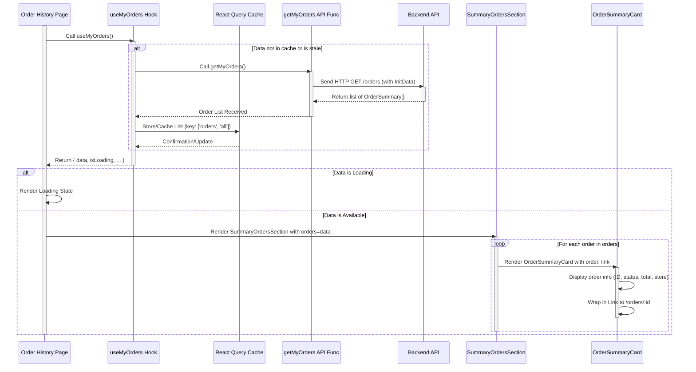

# Chapter 5: Order Domain Logic

Welcome back to the Telemora tutorial! In our previous chapters, we've built up key parts of our marketplace application: connecting to Telegram ([Chapter 1: Telegram Mini App Core Integration](01_telegram_mini_app_core_integration_.md)), knowing who the user is ([Chapter 2: User Domain Logic](02_user_domain_logic_.md)), and managing the stores and products they can interact with ([Chapter 3: Store Domain Logic](03_store_domain_logic_.md) and [Chapter 4: Product Domain Logic](04_product_domain_logic_.md)).

Now that users can see products, the natural next step is for them to *buy* those products. This is where the **Order Domain Logic** comes into play.

Imagine you've added items to your shopping cart and completed the purchase. What happens next? You'll want to see a confirmation, track the shipment, and perhaps look back at your past purchases. The **Order Domain Logic** is the dedicated part of our application's code that handles all of this.

It's like the application's "transaction manager" and "history book" for user purchases. It keeps track of what was bought, when, from which store, how much it cost, and what's happening with the delivery.

Specifically, this part of the codebase is responsible for:

* Defining how we represent orders, the items within them, and shipment information.
* Setting rules for creating or updating orders (like adding items or changing status).
* Communicating with the backend to create new orders or fetch existing ones.
* Providing easy ways for React components to access and manage order data.
* Offering reusable components to show order summaries, details, and tracking info.

A core use case for the Order Domain Logic is enabling a user to **view their order history**. This means seeing a list of all the orders they've placed in the past.

## The Core Use Case: Displaying User's Order History

When a user wants to see their past orders, they expect to find a list, probably sorted by date, showing a summary of each order – like the order number, total amount, status, and which store it was from. Clicking on a summary should take them to a detailed view of that specific order, showing all the items they bought and any shipment tracking information.

To achieve this, our application needs to:

1. Define the data structures for an order summary and full order details, including order items and shipment info.
2. Call the backend API to get the list of orders placed by the current user.
3. Use a React Query hook to handle fetching, loading, and caching this list.
4. Use reusable React components to display each order summary in the list and a detailed view for a single order.

The Order Domain Logic organizes these pieces together, primarily within the `src/libs/orders` directory.

## Defining Order Data (Types)

We need to define exactly what order data looks like using TypeScript interfaces. This ensures consistency and helps us understand the data flow. We'll need types for the status of an order, the items *within* an order, a summary view for lists, and a detailed view for a single order page. These are defined in `src/libs/orders/types/index.ts`.

```typescript
// src/libs/orders/types/index.ts (Simplified)

// Possible states of an order
export enum OrderStatus {
  PENDING = 'pending',
  CONFIRMED = 'confirmed',
  // ... other statuses like PROCESSING, SHIPPED, DELIVERED, etc.
  COMPLETED = 'completed',
  CANCELED = 'canceled',
}

// Simplified details for an item within an order list/preview
export interface OrderItemPreview {
  product: any; // Simplified ProductPreview type from Chapter 4
  quantity: number;
  totalPrice: number; // Price for this item * quantity
}

// Summary information for displaying in a list
export interface OrderSummary {
  id: number | string;
  status: OrderStatus;
  totalAmount: number; // Total for the whole order
  store: any; // Simplified StorePreview type from Chapter 3
  deliveryDate: Date; // Estimated delivery date
  createdAt: Date; // When the order was placed
}

// Full details for a single order page
export interface OrderDetail extends OrderSummary {
  items: OrderItemPreview[]; // List of items in the order
  shipment?: OrderShipment; // Optional shipment details
  payment?: any; // Simplified PaymentSummary type from Chapter 6
  buyer: any; // Simplified UserSummary type from Chapter 2
}

// Details about the shipment if applicable
export interface OrderShipment {
  id: number;
  trackingNumber: string;
  carrierTrackingUrl?: string; // Link to carrier tracking page
  status?: 'created' | 'in_transit' | 'delivered' | 'failed';
  courierService: string;
  deliveryEstimate: Date;
  shippedAt: Date; // When the order was shipped
}

// ... also includes types for creating/updating orders (DTOs)
```

These types show the structure of the data we handle. `OrderStatus` lists the different states an order can be in. `OrderItemPreview` describes an item *within* an order. `OrderSummary` is what you'd see in a list of orders, and `OrderDetail` includes everything for a single order's page, including the list of items (`items`) and potentially `shipment` information.

## Fetching Order Data (API)

To get the user's order history or the details of a specific order, we need to call our backend API. The API functions for orders are defined in `src/libs/orders/api/index.ts`.

```typescript
// src/libs/orders/api/index.ts (Simplified)
import httpClient from '@/libs/common/utils/http-client'; // Our HTTP tool
import {OrderDetail, OrderSummary} from '@/libs/orders/types';

// Function to fetch the list of orders for the current user
export async function getMyOrders() {
  // GET request to the '/orders' endpoint
  // The backend uses initData (sent automatically by httpClient)
  // to identify the current user and return their orders.
  return httpClient.get<OrderSummary[]>('orders');
}

// Function to fetch full details for a specific order
export async function getOrderDetails(id: number) {
  // GET request to '/orders/:id'
  return httpClient.get<OrderDetail>(`/orders/${id}`);
}

// ... other API functions for creating orders, adding shipments, etc.
```

The `getMyOrders` function uses `httpClient` ([Chapter 9: HTTP Client Utility](09_http_client_utility_.md)) to make a `GET` request to the `/orders` endpoint. As with users and stores, the backend uses the Telegram `initData` to know *whose* orders to return. `getOrderDetails` fetches the complete information for a single order by its ID.

For development purposes, the project often includes checks for `isDev` (`src/libs/common/utils/isDev.ts`) and returns mock data from files like `src/libs/orders/mocks/index.ts`. This allows building the UI without a fully functional backend initially. The `useQuery` hooks (explained next) often incorporate this `isDev` check directly.

## Making Data Fetching Easy (React Query Hooks)

As in previous chapters, React Query makes fetching and managing data in React much simpler. Custom hooks wrap our API functions to handle loading, errors, and caching. These are defined in `src/libs/orders/hooks/index.ts`.

```typescript
// src/libs/orders/hooks/index.ts (Simplified)
import {useQuery} from '@tanstack/react-query'; // React Query hook

import {queryKeys} from '@/libs/common/api/query-keys'; // Centralized query keys
import {getMyOrders, getOrderDetails} from '@/libs/orders/api'; // Our API functions
import {generateMockOrderDetail, generateMockOrderSummaries} from '@/libs/orders/mocks'; // Mock data
import {OrderDetail, OrderSummary} from '@/libs/orders/types';
import {isDev} from '../../common/utils'; // Helper for dev mode


// Custom hook to fetch the current user's orders list
export function useMyOrders() {
  return useQuery<OrderSummary[]>({
    // Unique key for React Query cache
    queryKey: queryKeys.orders.all,
    // The function that fetches data (uses mock data in dev)
    queryFn: isDev ? generateMockOrderSummaries : getMyOrders,
    // ... other configuration like staleTime, retry
  });
}

// Custom hook to fetch details for a specific order
export function useOrderDetails(id: number) {
  return useQuery<OrderDetail>({
    // Unique key includes the order ID
    queryKey: queryKeys.orders.detail(id),
    // Fetch function using the order ID (uses mock data in dev)
    queryFn: () => (isDev ? generateMockOrderDetail() : getOrderDetails(id)),
    // Only run this query if a valid ID is provided
    enabled: !!id,
  });
}

// ... other mutation hooks for creating/updating orders
```

The `useMyOrders` hook uses `useQuery` to call the `getMyOrders` API function (or the mock version in development). It provides the `data` (list of `OrderSummary`), `isLoading`, and `isError` states. The `queryKey: ['orders', 'all']` tells React Query to cache this specific list of orders.

The `useOrderDetails` hook is similar but fetches data for a single order based on its `id`. The `queryKey: ['orders', 'detail', id]` ensures that React Query caches the details *per order ID*. The `enabled: !!id` option means the query won't run until a valid `id` is provided, which is useful when the ID comes from a route parameter that might be initially undefined.

These hooks provide a clean way for components to get order data without directly interacting with the API or managing complex state logic. You can learn more about React Query in [Chapter 8: React Query Data Management](08_react_query_data_management_.md).

## Displaying Order Data (UI Components)

Now that we can easily fetch order data using the hooks, we need UI components to display it. The Order Domain Logic includes reusable components in `src/libs/orders/components`.

Let's look at `src/libs/orders/components/summary-card.tsx`, a component designed to show a summary of an order, suitable for a list of orders:

```typescript
// src/libs/orders/components/summary-card.tsx (Simplified)
'use client';

import {Card, CardBody, CardHeader, Chip} from '@heroui/react'; // UI components
import {format} from 'date-fns'; // For date formatting
import Link from 'next/link'; // For navigation

import PriceComponent from '@/libs/common/components/PriceComponent'; // Custom price formatting
import {OrderStatus, OrderSummary} from '@/libs/orders/types'; // Order data types

interface OrderSummaryCardProps {
  order: OrderSummary; // Component expects OrderSummary data
  href?: string; // Optional link for the card
  className?: string;
}

export default function OrderSummaryCard({order, href, className}: OrderSummaryCardProps) {
  const {id, status, totalAmount, store, deliveryDate, createdAt} = order;

  // Helper function to determine chip color based on order status
  const getOrderStatusColor = (s: OrderStatus) => {
    switch (s) {
      case OrderStatus.PENDING:
        return 'warning';
      case OrderStatus.SHIPPED:
        return 'primary';
      case OrderStatus.COMPLETED:
        return 'success';
      case OrderStatus.CANCELED:
        return 'danger';
      default:
        return 'default'; // Handle other statuses
    }
  };

  const cardContent = (
    <Card className = {`w-full ${className}`
}>
  {/* Basic Card structure */
  }
  <CardHeader className = "flex items-center justify-between" >
    <div>
      {/* Display Order ID and creation date/store */}
    < h3
  className = "text-sm font-semibold" > Order
#
  {
    id
  }
  </h3>
  < p
  className = "text-xs text-gray-500" >
    {format(new Date(createdAt), 'PP'
)
} —{
    ' '
  }
  <span className = "text-gray-400" > {store.name} < /span>
    < /p>
    < /div>
  {/* Display Order Status using a colored Chip */
  }
  <Chip color = {getOrderStatusColor(status)}
  size = "sm" >
    {status}
    < /Chip>
    < /CardHeader>

    < CardBody
  className = "text-sm text-gray-700" >
  <div className = "flex items-center justify-between" >
    {/* Display the total amount */}
    < PriceComponent
  amount = {totalAmount}
  />
  {/* Display estimated delivery date */
  }
  <div className = "text-right text-xs text-gray-500" >
  <p className = "font-medium" > Est.Delivery < /p>
    < p > {format(new Date(deliveryDate), 'PP'
)
}
  </p>
  < /div>
  < /div>
  < /CardBody>
  < /Card>
)
  ;

  // If an href is provided, wrap the card in a Link
  return href ? <Link href = {href} > {cardContent} < /Link> : cardContent;
}
```

This `OrderSummaryCard` component takes an `OrderSummary` object and displays key details like the order ID, date, store name, total amount, status (using a colored `Chip`), and estimated delivery date. The status color is determined by a helper function. It can optionally be wrapped in a `Link` to navigate to the order's detail page.

This summary card is then used by a component that displays a list of orders, like `src/libs/orders/components/summary-orders-section.tsx`:

```typescript
// src/libs/orders/components/summary-orders-section.tsx (Simplified)
import {Button} from '@heroui/react'; // UI component
import React from 'react';

import OrderSummaryCard from '@/libs/orders/components/summary-card'; // Our summary card
import {OrderSummary} from '@/libs/orders/types'; // Order data type

export default function SummaryOrdersSection({
                                               orders, // Receives a list of OrderSummary objects
                                               title,
                                             }: {
  orders: OrderSummary[];
  title: string;
}) {
  return (
    <section className = "space-y-4" >
      <h1>{title} < /h1>
      < div
  className = "space-y-4" >
    {
      orders.length === 0 ? (
        // Show a message or button if no orders exist
        <p>No orders found.</p> /
  / Or a button like in stores/
  products
  // <Button as={'link'} href="/orders"> Create your first order </Button>
) :
  (
    // Map over the list of orders
    orders.map((order) => (
      // Render an OrderSummaryCard for each order, linking to its detail page
      <OrderSummaryCard key = {order.id}
  order = {order}
  href = {`/orders/${order.id}`
}
  />
))
)
}
  </div>
  < /section>
)
  ;
}
```

This `SummaryOrdersSection` component takes a list of `OrderSummary` objects (which would come from the `useMyOrders` hook) and renders an `OrderSummaryCard` for each one, automatically creating a link to the detail page for that order.

For displaying the details of a single order (`OrderDetail`), there's a component like `src/libs/orders/components/order-item-preview.tsx` to show each item within the order:

```typescript
// src/libs/orders/components/order-item-preview.tsx (Simplified)
import {Card, CardBody, Chip} from '@heroui/react'; // UI components
import Image from 'next/image'; // For images
import Link from 'next/link'; // For linking to product page
import React from 'react';

import PriceComponent from '@/libs/common/components/PriceComponent'; // Price formatting
import {OrderItemPreview} from '@/libs/orders/types'; // Order item data type

export default function OrderItemPreviewCard({orderItem}: { orderItem: OrderItemPreview }) {
  return (
    <Card>{/* Card for a single item */}
    < CardBody
  className = "flex flex-row justify-between text-sm" >
  <div className = "flex gap-x-4" >
    {/* Link to the product page if slug is available */}
  {
    orderItem.product.slug && (
      <Link href = {`/products/${orderItem.product.slug}`
  }>
    {/* Display product image */
    }
    <Image
      src = {orderItem.product.image?.[0]?.url || "/fallback-image.png"}
    alt = {orderItem.product.name} // Simplified alt text
    width = {64}
    height = {64}
    className = "aspect-square rounded object-cover"
      / >
      </Link>
  )
  }
  <div className = "space-y-4" >
    {/* Link to product name or just display it */}
  {
    orderItem.product.slug ? (
      <Link href = {`/products/${orderItem.product.slug}`
  }>
    <h3 className = "truncate max-w-[10rem] line-clamp-1 font-bold text-inherit" > {orderItem.product.name} < /h3>
      < /Link>
  ) :
    (
      <h3 className = "truncate max-w-[10rem] line-clamp-1 font-bold" > {orderItem.product.name} < /h3>
    )
  }
  {/* Display price for this quantity */
  }
  <PriceComponent amount = {orderItem.totalPrice}
  />
  < /div>
  < /div>
  {/* Display quantity */
  }
  <Chip size = "sm" > x
  {
    orderItem.quantity
  }
  </Chip>
  < /CardBody>
  < /Card>
)
  ;
}
```

The `OrderItemPreviewCard` takes a single `OrderItemPreview` and shows the product image, name (linking to the product details), the total price for this item (price * quantity), and the quantity itself. A detailed order page would use `useOrderDetails` to fetch the full `OrderDetail` and then map over the `orderDetail.items` array, rendering an `OrderItemPreviewCard` for each item. The detailed page would also display the overall order status, total, and `shipment` information if available.

## Conceptual Flow: Displaying Order History

Here's a simplified flow showing how a page would display the user's order history using the Order Domain Logic:



This diagram shows that the Order History Page component calls the `useMyOrders` hook. React Query manages fetching the data from the backend via the `getMyOrders` API function and caches it. Once the data (a list of `OrderSummary`) is available, React Query provides it to the hook, and the Page component receives it. The Page then renders the `SummaryOrdersSection`, which maps over the list and displays each order using an `OrderSummaryCard`. Each card includes a link generated using the order's ID, allowing the user to click through to see the full `OrderDetail`.

## Creating and Updating Orders/Shipments (Schemas and Mutations)

Besides fetching, the Order Domain Logic also handles actions like creating a new order (typically after checkout), updating an order's status, or adding shipment information (for sellers). This involves:

1. **Schemas:** Defining the structure and validation rules for data sent to the backend using `zod`. These are in `src/libs/orders/schemas/index.ts`. Example: `createOrderSchema` for placing a new order, `createOrderShipmentSchema` for adding tracking details, `updateOrderSchema` for changing status or address.
2. **API Functions:** Sending the validated data to the backend using `httpClient.post` or `httpClient.patch`. These are in `src/libs/orders/api/index.ts`. Examples: `createOrder`, `addShipment`, `updateOrder`.
3. **React Query Hooks (Mutations):** Wrapping the API calls with `useMutation` hooks to manage sending data, tracking progress, and handling responses. These are in `src/libs/orders/hooks/index.ts`.

Let's look at the hooks for creating an order and adding shipment details:

```typescript
// src/libs/orders/hooks/index.ts (Simplified Mutations)
import {useMutation, useQueryClient} from '@tanstack/react-query';
import {queryKeys} from '@/libs/common/api/query-keys'; // Query keys for cache invalidation
import {createOrder, addShipment, updateOrder} from '@/libs/orders/api'; // API functions
import {CreateOrderFormData, CreateOrderShipmentFormData, UpdateOrderFormData} from '@/libs/orders/schemas'; // Schemas/Types for data

export function useCreateOrder() {
  const queryClient = useQueryClient(); // To interact with the query cache

  return useMutation<OrderDetail, Error, CreateOrderFormData>({
    mutationFn: (data) => createOrder(data), // Call the createOrder API function
    onSuccess: async () => {
      // On successful order creation, invalidate the list of "my orders"
      // so that the new order appears automatically next time the list is fetched.
      queryClient.invalidateQueries({queryKey: queryKeys.orders.all});
      // You might also prefetch or manually update the cache if needed
    },
    // ... onError, onMutate etc.
  });
}

export function useUpdateOrder(id: number) {
  const queryClient = useQueryClient();

  return useMutation<OrderDetail, Error, UpdateOrderFormData>({
    mutationFn: (data) => updateOrder(id, data), // Call updateOrder for a specific ID
    onSuccess: () => {
      // On successful update, invalidate the specific order's details
      // AND potentially the list of all orders if the update affects the summary.
      queryClient.invalidateQueries({queryKey: queryKeys.orders.all});
      queryClient.invalidateQueries({queryKey: queryKeys.orders.detail(id)});
    },
    // ... onError
  });
}


export function useAddShipment(id: number) {
  const queryClient = useQueryClient();

  return useMutation<OrderDetail, Error, CreateOrderShipmentFormData>({
    mutationFn: (data) => addShipment(id, data), // Call addShipment for a specific order ID
    onSuccess: () => {
      // Adding shipment details changes the OrderDetail, so invalidate the detail query.
      // This will cause the order detail page to refetch and show the shipment info.
      queryClient.invalidateQueries({queryKey: queryKeys.orders.detail(id)});
    },
    // ... onError
  });
}
```

These mutation hooks provide functions (`mutate`, `mutateAsync`) that components can call to perform actions like placing a new order (`useCreateOrder`) or adding tracking information to an existing order (`useAddShipment`). The hooks also give access to the pending state (`isPending`) and the result (`data`, `error`).

The `onSuccess` handlers are crucial. After a mutation successfully modifies data on the backend, we need to ensure the client-side cache managed by React Query reflects these changes. Invalidating relevant queries (`queryClient.invalidateQueries`) tells React Query that the cached data for those keys might be outdated and should be refetched the next time a component requests it, ensuring the UI stays synchronized with the backend. For example, creating a new order invalidates the `my orders` list cache, and adding shipment details invalidates the cache for that specific order's details.

Components (like a "Checkout" page or a seller's "Add Shipment" form) would use these hooks, often in conjunction with form management libraries (`react-hook-form`) and schema validation (`zod`) to collect and send the necessary data securely and correctly.

## Conclusion

In this chapter, we explored the **Order Domain Logic**, understanding that it's the essential system for handling user purchases, order history, and tracking. We learned how it defines the structure of order and shipment data using **types**, handles fetching lists of orders or individual order details via **API functions** and **React Query hooks** (`useMyOrders`, `useOrderDetails`). We also saw how it uses reusable **UI components** like `OrderSummaryCard` and `OrderItemPreviewCard` for displaying this information. Finally, we touched upon how the domain supports actions like creating orders and adding shipment details using **schemas** for validation, dedicated **API functions** (`createOrder`, `addShipment`), and **React Query mutation hooks** (`useCreateOrder`, `useAddShipment`), along with the importance of cache invalidation.

This dedicated domain logic centralizes all order-related functionality, making it easier to build features like a user's order history page, a detailed order view, and potentially seller interfaces for managing orders and shipments.

With our core domain logics (User, Store, Product, Order) in place, the final piece of the purchasing puzzle is handling the actual payment. In the [next chapter](06_payment_integration__ton_connect__.md), we will dive into **Payment Integration (TON Connect)**.

[Next Chapter: Payment Integration (TON Connect)](06_payment_integration__ton_connect__.md)

---
