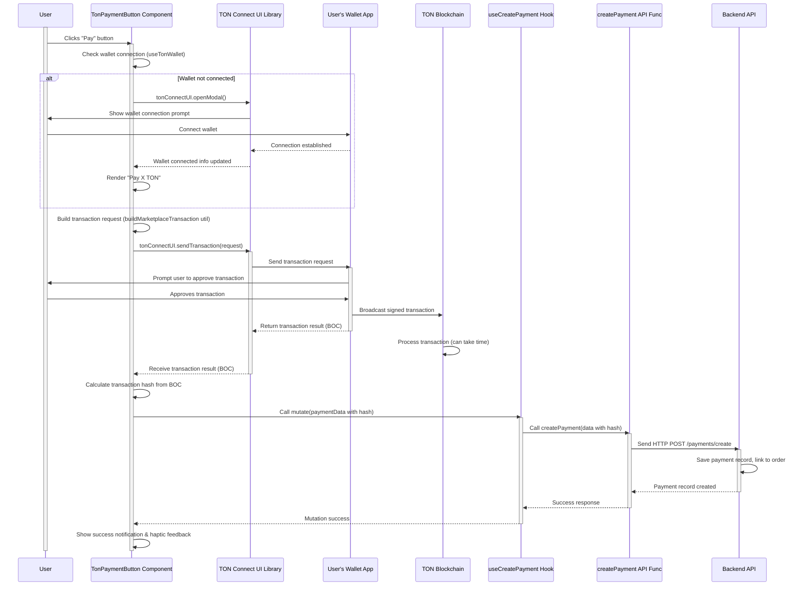

# Chapter 6: Payment Integration (TON Connect)

Welcome back to the Telemora tutorial! So far, we've learned how our app talks to Telegram ([Chapter 1: Telegram Mini App Core Integration](01_telegram_mini_app_core_integration_.md)), manages users ([Chapter 2: User Domain Logic](02_user_domain_logic_.md)), handles stores ([Chapter 3: Store Domain Logic](03_store_domain_logic_.md)), and deals with products ([Chapter 4: Product Domain Logic](04_product_domain_logic_.md)) and orders ([Chapter 5: Order Domain Logic](05_order_domain_logic_.md)).

Now comes the exciting part – paying for those orders! Since Telemora uses the TON blockchain for payments, this requires a special process: connecting with the user's TON wallet and initiating a blockchain transaction. This is the role of the **Payment Integration (TON Connect)** domain logic.

Think of this domain logic as the secure payment terminal of our app. It doesn't handle your physical credit card, but it handles the process of connecting to a digital wallet and sending cryptocurrency (TON) over the blockchain.

Why do we need a dedicated system for this? Because blockchain payments are quite different from traditional ones:

1. You need to interact directly with the user's crypto wallet (which could be a separate app or browser extension).
2. You need to build the payment instructions (the transaction data) in a format the blockchain understands.
3. The user needs to explicitly approve the transaction in their wallet for security.
4. Once sent, the transaction needs to be confirmed on the blockchain.
5. You need to record the details of this blockchain transaction on your own backend for tracking and order fulfillment.

The **Payment Integration (TON Connect)** domain logic bundles everything required for this complex process. It includes:

* Utilities to correctly format transaction data for the TON blockchain.
* Definitions of what payment records look like.
* React Query hooks to communicate payment status and details with our backend.
* UI components that use the `@tonconnect/ui-react` library to interact with the user's wallet.

A central use case is enabling a user to **pay for a specific order using their connected TON wallet**. This means showing a button that, when clicked, guides the user through the wallet connection (if needed) and the transaction approval process.

## The Core Use Case: Paying for an Order

Imagine a user has finished adding items to their cart and is ready to checkout. On the checkout or order summary page, they need a button to initiate the payment. When they click it, the app should connect to their TON wallet, ask them to confirm the amount and recipient, and then send the payment on the blockchain. Afterward, the app needs to save a record of this successful payment linked to their order.

To make this happen, our application needs to:

1. Know how to connect to TON wallets using a standard protocol (TON Connect).
2. Structure the data needed for a TON transaction, including who is paying, who is receiving, the amount, and any extra data for the smart contract.
3. Display a button that triggers this wallet interaction.
4. Receive confirmation from the wallet after the user approves the transaction.
5. Send details of the completed transaction (like the transaction hash) to our backend to record the payment.
6. Define the data structure for tracking these payment records on our backend.

The Payment Integration domain logic (`src/libs/payments`) provides all the necessary pieces.

## Defining Payment Data (Types)

We first need to define how we represent payment records within our application using TypeScript interfaces. This helps standardize the data we send to and receive from our backend regarding payments. These are defined in `src/libs/payments/types/index.ts`.

```typescript
// src/libs/payments/types/index.ts (Simplified)

// Possible states a payment record can be in
export enum PaymentStatus {
  PENDING = 'pending', // Initiated but not confirmed
  PROCESSING = 'processing', // Transaction sent, waiting for confirmation
  COMPLETED = 'completed', // Confirmed on blockchain
  FAILED = 'failed',     // Transaction failed or rejected
  REFUNDED = 'refunded', // Payment was refunded
}

// Basic info for displaying a list of payments
export interface PaymentSummary {
  id: number | string;
  status: PaymentStatus;
  amount: string; // Amount paid
  transactionHash: string; // The unique blockchain transaction ID
  createdAt: Date;
}

// Full details for a single payment record
export interface PaymentDetail extends PaymentSummary {
  gasFee?: string; // Transaction fee
  commission?: string; // Commission taken by marketplace
  fromWalletAddress?: string; // Sender's wallet address
  toWalletAddress?: string; // Recipient's wallet address (e.g., seller)
  order: any; // Simplified OrderSummary type from Chapter 5
  user: any; // Simplified UserSummary type from Chapter 2
}

// Data structure for creating a new payment record on the backend
export interface CreatePaymentDto {
  orderId?: string; // Optional: link to an order
  amount: string; // Amount in nanoTON (string to handle large numbers)
  fromWalletAddress?: string;
  toWalletAddress?: string;
  transactionHash: string; // The hash from the completed transaction
}

// ... UpdatePaymentDto and other related types
```

These types cover the different states a payment can have (`PaymentStatus`), the data needed for a basic list (`PaymentSummary`), the full details (`PaymentDetail`), and the structure required when we tell our backend that a transaction has happened (`CreatePaymentDto`). Notice that `CreatePaymentDto` includes the `transactionHash`, which is key to linking our internal payment record to the actual blockchain transaction.

## Connecting to TON Wallets (TON Connect UI Provider)

To interact with the user's wallet, we use the official `@tonconnect/ui-react` library. This library provides React components and hooks that simplify the TON Connect protocol.

The `TonConnectUIProvider` is a component from this library that needs to wrap our application (or the parts that need wallet interaction). It initializes the TON Connect UI, handles connecting to various wallets, and provides the necessary context for the hooks.

You can see where this provider is set up in `src/providers/TonConnectClientProvider.tsx`:

```typescript
// src/providers/TonConnectClientProvider.tsx
'use client'; // Important for Next.js client components

import { TonConnectUIProvider } from '@tonconnect/ui-react'; // The provider component
import { type PropsWithChildren } from 'react';

export default function TonConnectClientProvider({ children }: PropsWithChildren) {
  return (
    // Wrap children with the provider, specifying the manifest URL
    <TonConnectUIProvider manifestUrl="/tonconnect-manifest.json">
      {children} {/* The rest of your app */}
    </TonConnectUIProvider>
  );
}
```

This `TonConnectClientProvider` component simply wraps its children with `TonConnectUIProvider`. The `manifestUrl="/tonconnect-manifest.json"` property is important. It points to a small file hosted on our web server that contains metadata about our app (like its name, description, and icon). TON wallets use this manifest to show the user what app is requesting connection, ensuring trust and security.

As seen in [Chapter 1](01_telegram_mini_app_core_integration_.md), providers like this are typically placed high in the component tree, often within the main `AppProvider` (`src/providers/AppProvider.tsx`):

```typescript
// src/providers/AppProvider.tsx (Snippet showing TonConnectClientProvider placement)
'use client';

import dynamic from 'next/dynamic';
import {PropsWithChildren} from 'react';

const InitTelegram = dynamic(() => import('@/libs/common/components/init-telegram'), {
  ssr: false,
});

// Import TonConnectClientProvider
import TonConnectClientProvider from '@/providers/TonConnectClientProvider';
// Import other providers used later
// import { QueryContext } from '@/libs/common/context/queryContext';
// import { UserProvider } from '@/libs/users/context/userContext';

export function AppProvider({children}: PropsWithChildren) {
  return (
    <>
      <InitTelegram>
        {/* TonConnectClientProvider wraps the content that needs wallet access */}
    < TonConnectClientProvider >
    {/* Other providers like QueryContext and UserProvider would also be inside */}
  {/* <QueryContext> */
  }
  {/*   <UserProvider>{children}</UserProvider> */
  }
  {/* </QueryContext> */
  }
  {
    children
  }
  {/* The rest of your application */
  }
  </TonConnectClientProvider>
  < /InitTelegram>
  < />
)
  ;
}
```

By placing `TonConnectClientProvider` here, any component within our application can now use the `@tonconnect/ui-react` hooks to connect to wallets and send transactions.

## Building TON Transaction Payloads (Utils)

TON blockchain transactions aren't just sending TON coins; they often include extra data, especially when interacting with smart contracts (like a marketplace contract). This extra data is called the **payload**. Building this payload requires specific TON development tools.

The code in `src/libs/payments/utils/index.ts` is responsible for formatting this payload and building the overall transaction request object that we send to the wallet via TON Connect.

```typescript
// src/libs/payments/utils/index.ts (Simplified)
import { Address, beginCell, toNano } from '@ton/core'; // TON core libraries
import { SendTransactionRequest } from '@tonconnect/ui'; // Type definition for transaction request

// Helper function to encode the data specific to our marketplace smart contract
function encodeMarketplacePayload({
  seller, // Seller's wallet address (string)
  marketplace, // Marketplace wallet address (string)
  amountTon, // Amount being paid (number)
  commissionPercent, // Commission percentage (number)
}) {
  // Start building a Cell (TON's data structure)
  const cell = beginCell()
    .storeAddress(Address.parse(seller)) // Store seller address
    .storeAddress(Address.parse(marketplace)) // Store marketplace address
    .storeCoins(toNano(amountTon)) // Store amount in nanoTON
    .storeUint(commissionPercent, 16) // Store commission (e.g., 16 bits for percentage)
    .endCell(); // Finalize the Cell

  // Convert the Cell to Base64 string (BOC - Bag of Cells)
  return cell.toBoc().toString('base64');
}

// Function to build the complete transaction request object for TON Connect
export function buildMarketplaceTransaction({
  amountTon, // Total amount to send in TON (number)
  sellerAddress, // Seller's wallet address (string)
  marketplaceAddress, // Marketplace's wallet address (string)
  smartContractAddress, // The smart contract address handling the payment (string)
  commissionPercent, // Commission percentage (number)
}): SendTransactionRequest {
  // Encode the specific marketplace data into a payload Cell
  const payload = encodeMarketplacePayload({
    seller: sellerAddress,
    marketplace: marketplaceAddress,
    amountTon,
    commissionPercent,
  });

  // Create the transaction request object
  return {
    validUntil: Math.floor(Date.now() / 1000) + 300, // Transaction valid for 5 mins
    messages: [ // List of messages to send (usually one for simple payments)
      {
        address: smartContractAddress, // The recipient address (often a smart contract)
        amount: (amountTon * 1e9).toFixed(0), // Amount in nanoTON (as string)
        payload, // The encoded marketplace payload
      },
    ],
  };
}
```

The `encodeMarketplacePayload` function is a low-level utility using the `@ton/core` library. It takes details needed by the specific marketplace smart contract (like seller, marketplace addresses, amount, commission) and encodes them into a `Cell`. A `Cell` is a fundamental data structure on TON used to represent information. The methods like `storeAddress`, `storeCoins`, and `storeUint` write data into the cell. `toNano` converts TON amounts (like 1.5 TON) into the smallest unit, nanoTON (1.5 * 10^9). Finally, `toBoc().toString('base64')` converts the Cell into a format suitable for passing around, a Base64 string representation of the Bag of Cells (BOC).

The `buildMarketplaceTransaction` function uses `encodeMarketplacePayload` to get the necessary data payload. It then constructs the final `SendTransactionRequest` object, which is the format expected by the `@tonconnect/ui-react` library's `sendTransaction` function. This object includes:

* `validUntil`: A timestamp indicating how long the transaction is valid.
* `messages`: An array of messages to be sent. For a simple payment through a smart contract, this is usually one message targeted at the `smartContractAddress`.
* Each message specifies the `address` (the smart contract or wallet receiving the main TON amount), the `amount` (in nanoTON), and the optional `payload` (our encoded marketplace data).

This utility function is crucial because it correctly prepares the data for the user's wallet to sign and broadcast on the TON network according to the expected format of the smart contract.

## Recording the Payment on the Backend (API & Hook)

After the user approves the transaction in their wallet and it's sent to the TON blockchain, we need to record this payment information on our backend. This links the blockchain transaction to the user and their specific order in our database.

The API function for this is in `src/libs/payments/api/index.ts`:

```typescript
// src/libs/payments/api/index.ts (Simplified)
import httpClient from '@/libs/common/utils/http-client'; // Our HTTP tool
import {CreatePaymentDto, PaymentDetail, PaymentSummary} from '@/libs/payments/types';
import {isDev} from '../../common/utils'; // Dev mode helper

// Function to create a new payment record on our backend
export async function createPayment(data: CreatePaymentDto) {
  // In development, return mock data. Otherwise, make a real API call.
  return isDev
    ? generateMockPaymentDetail() // Returns mock PaymentDetail
    : httpClient.post<PaymentDetail>('/payments/create', data); // POST request to create payment
}

// ... other API functions for fetching payments, details, etc.
// (These use get<PaymentSummary[]>('/payments') or get<PaymentDetail>(`/payments/${id}`))
```

The `createPayment` function takes a `CreatePaymentDto` object (containing details like `orderId`, `amount`, and crucially, `transactionHash`) and sends it to our backend's `/payments/create` endpoint using `httpClient.post`. Our backend receives this data, saves a new payment record in its database, and might then process the order (e.g., notify the seller, update order status).

To use this API function easily in React components and manage the asynchronous nature, loading state, and potential errors, we use a React Query mutation hook in `src/libs/payments/hooks/index.ts`:

```typescript
// src/libs/payments/hooks/index.ts (Simplified)
import { useMutation, useQueryClient } from '@tanstack/react-query'; // React Query hooks
import { queryKeys } from '@/libs/common/api/query-keys'; // Centralized query keys

import { createPayment } from '@/libs/payments/api'; // Our API function
import { CreatePaymentDto } from '@/libs/payments/types'; // Type for input data

// Custom hook to create a payment record on the backend
export function useCreatePayment() {
  const queryClient = useQueryClient(); // To interact with the cache

  return useMutation({
    // mutationFn receives the CreatePaymentDto data
    mutationFn: (data: CreatePaymentDto) => createPayment(data),
    onSuccess: () => {
      // After successfully creating a payment record,
      // invalidate the 'my orders' list cache (from Chapter 5)
      // so that the order status/details might update automatically
      // on the UI the next time that data is fetched.
      queryClient.invalidateQueries({ queryKey: queryKeys.orders.all });
      // You might also invalidate the specific order's detail query:
      // queryClient.invalidateQueries({ queryKey: queryKeys.orders.detail(orderId) });
    },
    // ... onError, onMutate etc.
  });
}

// ... usePayments and usePaymentDetails hooks for fetching data follow similar patterns
// using useQuery and queryKeys.payments.all, queryKeys.payments.detail(id)
```

The `useCreatePayment` hook uses `useMutation` from React Query. It wraps the `createPayment` API function. A component can call `const mutation = useCreatePayment();` and then initiate the process of saving the record by calling `mutation.mutate(paymentData)`. The hook provides `isPending`, `isError`, and `data` (the response from the backend, typically the newly created `PaymentDetail`).

The `onSuccess` handler is used here to invalidate relevant query caches. When a new payment record is successfully created, it often means the status of the associated order has changed (e.g., from PENDING to PROCESSING or PAID). Invalidating the `orders.all` query key tells React Query that the list of the user's orders might be outdated and should be refetched, ensuring the Order History page shows the updated status without manual refresh.

## The Payment Button Component (`TonPaymentButton`)

The `TonPaymentButton` component (`src/libs/payments/components/ton-payment-button.tsx`) is the user-facing part that ties the TON Connect interaction and the backend payment record together. It's a standard React component that orchestrates the payment flow.

```typescript
// src/libs/payments/components/ton-payment-button.tsx (Simplified)
'use client'; // Client-side component

import { environment } from '@environments'; // Application environment variables
import { Button } from '@heroui/react'; // UI button component
import { hapticFeedback } from '@telegram-apps/sdk-react'; // Telegram haptic feedback
import { Cell } from '@ton/core'; // TON core library for BOC parsing/hashing
import { useTonAddress, useTonConnectUI, useTonWallet } from '@tonconnect/ui-react'; // TON Connect UI hooks
import toast from 'react-hot-toast'; // For notifications

import { useCreatePayment } from '@/libs/payments/hooks'; // Our hook to create backend payment record
import { buildMarketplaceTransaction } from '@/libs/payments/utils'; // Utility to build TON transaction payload

interface TonPaymentButtonProps {
  amountTon: number; // Payment amount in TON
  sellerAddress: string; // Seller's wallet address
  orderId?: string; // Optional Order ID to link the payment to
}

export function TonPaymentButton({ amountTon, sellerAddress, orderId }: TonPaymentButtonProps) {
  // Get access to the TON Connect UI instance and wallet info
  const [tonConnectUI] = useTonConnectUI();
  const wallet = useTonWallet(); // Info about the connected wallet
  const userAddress = useTonAddress(false); // User's wallet address (friendly format)

  // Get the mutation function for creating a backend payment record
  const { mutateAsync: createPayment } = useCreatePayment();

  // Get required addresses/configs from environment variables
  const marketplaceAddress = environment.apiUrl; // Placeholder, should be contract address
  const smartContractAddress = environment.smartContractAddress;
  const commissionPercent = environment.commissionPercent;

  // Function triggered when the button is pressed
  const handlePay = async () => {
    // 1. Check if wallet is connected
    if (!wallet) {
      toast.error('Please connect your wallet');
      await tonConnectUI.openModal(); // Open the TON Connect modal
      return;
    }

    try {
      // 2. Build the transaction request using our utility
      const transactionRequest = buildMarketplaceTransaction({
        amountTon,
        sellerAddress,
        marketplaceAddress,
        smartContractAddress,
        commissionPercent: Number(commissionPercent),
      });

      // 3. Send the transaction request to the wallet via TON Connect UI
      // This opens the wallet app/popup for user approval
      const { boc } = await tonConnectUI.sendTransaction(transactionRequest);

      // 4. Process the response: Get the transaction hash
      // The BOC contains the signed transaction data
      const hash = Cell.fromBoc(Buffer.from(boc, 'base64'))[0].hash().toString('hex');
      console.log('TON Transaction BOC:', boc);
      console.log('TON Transaction Hash:', hash);


      // 5. Record the payment details on our backend
      await createPayment({
        orderId,
        amount: (amountTon * 1e9).toFixed(0), // Send amount in nanoTON as string
        fromWalletAddress: userAddress,
        toWalletAddress: sellerAddress, // Or the smart contract address
        transactionHash: hash, // Include the transaction hash
      });

      // 6. Provide feedback to the user
      toast.success('Payment sent & saved!');
      hapticFeedback.impactOccurred('light'); // Use Telegram's haptic feedback
    } catch (error) {
      // Handle errors (user rejected, network issue, etc.)
      console.error('TON payment failed:', error);
      toast.error('Payment failed or cancelled');
    }
  };

  // Render the button, changing text based on wallet connection status
  return (
    <Button color="primary" fullWidth onPress={handlePay} isDisabled={!smartContractAddress}>
      {wallet ? `Pay ${amountTon} TON` : 'Connect Wallet to Pay'}
    </Button>
  );
}
```

This component demonstrates the full flow:

* It uses `@tonconnect/ui-react` hooks (`useTonConnectUI`, `useTonWallet`, `useTonAddress`) to check wallet status and get the UI instance.
* It uses our `useCreatePayment` hook to get the function for saving the backend record.
* The `handlePay` asynchronous function is triggered when the button is clicked:
* It first checks if a `wallet` is connected. If not, it shows an error and calls `tonConnectUI.openModal()` to prompt the user to connect.
* If a wallet is connected, it calls `buildMarketplaceTransaction` from our utils to prepare the transaction request object.
* It then calls `tonConnectUI.sendTransaction(transactionRequest)`. This is the core step that communicates with the wallet. The wallet UI appears, prompting the user to review and approve the transaction. `await` pauses execution here until the user interacts with their wallet.
* If the user approves, `sendTransaction` returns an object containing the transaction's `boc`.
* It extracts the `boc` and uses `@ton/core` utilities (`Cell.fromBoc`, `.hash()`) to calculate the unique `transactionHash`.
* It then calls `createPayment({...})` (the mutation function from `useCreatePayment`) to send the payment details, *including the `transactionHash`*, to our backend.
* Finally, it shows success messages using `react-hot-toast` and provides haptic feedback via the Telegram SDK ([Chapter 1](01_telegram_mini_app_core_integration_.md)).
* The `catch` block handles errors, such as the user rejecting the transaction in their wallet.

The button's text changes based on whether a wallet is connected, guiding the user. The `isDisabled` prop prevents interaction if essential addresses (like the smart contract address) are missing from the environment config.

This `TonPaymentButton` component encapsulates the entire complex flow of initiating a TON payment and linking it back to our backend records, making it easy to drop into any page where a payment is needed (like an Order Summary or Checkout page).

## Conceptual Flow: Paying for an Order

Here's how the pieces fit together when a user clicks the "Pay" button:



This diagram illustrates the journey: The user clicks the button, which checks the wallet connection. It prepares the TON-specific transaction data and asks the TON Connect UI to send it to the user's wallet. The wallet application takes over, prompts the user, and if approved, sends the transaction to the blockchain. Crucially, after the wallet confirms it has *sent* the transaction (even if not yet fully confirmed on the chain), the TON Connect UI returns the transaction data (like the BOC) back to our web app. Our `TonPaymentButton` component then extracts the transaction hash from this data and uses the `useCreatePayment` hook to save a record on our backend, linking this payment attempt to the user's order via the unique blockchain hash. The backend can later verify the transaction status on the blockchain using this hash.

## Conclusion

In this chapter, we explored the **Payment Integration (TON Connect)** domain logic, understanding that it's the specialized system for handling blockchain payments using the TON network. We learned how the `TonConnectUIProvider` initializes the connection with TON wallets, how utilities in `src/libs/payments/utils` correctly format transaction data for the TON blockchain, and how the `TonPaymentButton` component orchestrates the interaction with the wallet via `@tonconnect/ui-react`. We also saw how the `createPayment` API function and the `useCreatePayment` React Query hook are used to record the transaction details on our backend *after* the user approves it in their wallet, linking our internal order/payment records to the immutable history on the blockchain via the transaction hash.

This domain logic centralizes the complex process of integrating with TON wallets and handling blockchain transactions, providing a clean and reusable way to enable payments in our application.

With our core domain logics (User, Store, Product, Order, Payment) covered, we have the foundation of the application's data and logic. The next steps involve arranging these pieces into a user-friendly interface. In the [next chapter](07_ui_layouts_and_navigation_.md), we will dive into **UI Layouts and Navigation**.

[Next Chapter: UI Layouts and Navigation](07_ui_layouts_and_navigation_.md)

---
