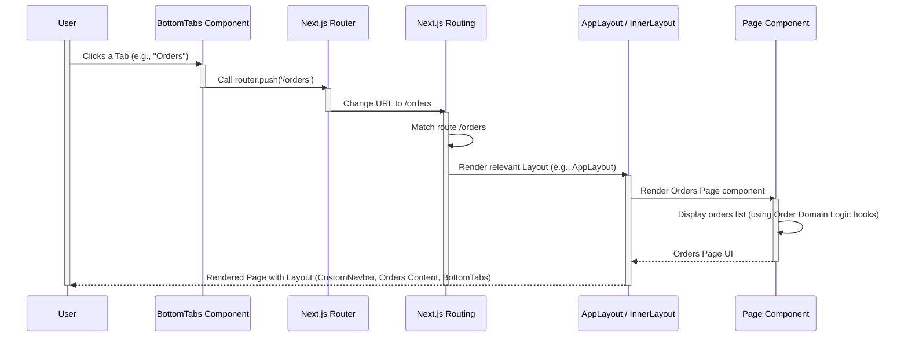

# Chapter 7: UI Layouts and Navigation

Welcome back to the Telemora tutorial! In the previous chapters, we've focused on the core "brain" and "muscles" of our application – how it talks to Telegram ([Chapter 1: Telegram Mini App Core Integration](01_telegram_mini_app_core_integration_.md)), knows the user ([Chapter 2: User Domain Logic](02_user_domain_logic_.md)), manages stores ([Chapter 3: Store Domain Logic](03_store_domain_logic_.md)) and products ([Chapter 4: Product Domain Logic](04_product_domain_logic_.md)), handles orders ([Chapter 5: Order Domain Logic](05_order_domain_logic_.md)), and even processes payments using TON ([Chapter 6: Payment Integration (TON Connect)](06_payment_integration__ton_connect__.md)).

Now that our app has all this powerful backend logic, we need to organize it visually so users can easily see information and move between different parts of the application. This is where **UI Layouts and Navigation** come in.

Think of it like designing a building after the foundation and structure are in place. You need to decide where the entrance is, how people move between floors, where the common areas are, and ensure consistent elements like hallways and staircases. In a web application, UI layouts and navigation define:

1. **Visual Structure:** Consistent headers, footers, sidebars, or main content areas that appear across different screens.
2. **Navigation Flow:** How users find their way around the app, moving from a list to a detail page, or switching between major sections.

This concept ensures that no matter which part of the Telemora app a user is in, they have a familiar structure and clear ways to get to where they want to go. It prevents the user from feeling lost.

A central use case for this is providing a **consistent look and feel** across the main sections of the app and allowing users to **easily switch between them**.

## The Core Use Case: Consistent Structure and Main Navigation

Imagine the main sections of our app: the Market (for browsing products), Stores (for managing/viewing shops), Orders (for tracking purchases), and Profile (for user settings). We want these main sections to share common elements, like a header at the top showing who is logged in and a persistent navigation bar at the bottom to jump between these four sections.

To achieve this, our application needs:

1. An overall structure that wraps most of the app's content.
2. A component for the consistent header.
3. A component for the consistent bottom navigation bar.
4. A way to handle navigation *within* major sections (e.g., going from a list of products to a single product's detail page) which might require a different header (like a "back" button).

The UI Layouts and Navigation abstraction group focuses on building these reusable structural and navigation components, primarily found in `src/libs/common/components`.

## Key Components for Layouts and Navigation

The Telemora project uses several key components to manage its UI structure and navigation:

* **`AppLayout.tsx`:** This is the main layout component. It provides the top-level structure for pages that represent one of the primary application sections (Market, Stores, Orders, Profile).
* **`CustomNavbar.tsx`:** A specific implementation of a top navigation bar (Navbar) used in the `AppLayout`. It typically shows user-related information or links.
* **`BottomTabs.tsx`:** A component providing a persistent bottom navigation bar with tabs for switching between the main application sections.
* **`InnerLayout.tsx`:** A different layout component intended for pages *nested* within a main section (like a product detail page or a store detail page). It typically includes a backward navigation header.
* **`BackwardNavbar.tsx`:** A simple Navbar component primarily used in `InnerLayout` that provides a "go back" link.

Let's look at how these components are structured and used.

## Building the Main App Structure (`AppLayout`)

The `AppLayout` component defines the overall structure for the main screens of the application. It uses the `CustomNavbar` for the header and `BottomTabs` for the footer navigation.

Here's a simplified look at `src/libs/common/components/AppLayout.tsx`:

```typescript
// src/libs/common/components/AppLayout.tsx
'use client';

import React, { PropsWithChildren } from 'react';

// Import the bottom tabs navigation component
import BottomTabs from '@/libs/common/components/BottomTabs';

// Import the custom top navbar component
import CustomNavbar from './navbar';

// AppLayout component takes children (the page content)
export default function AppLayout({ children }: PropsWithChildren) {
  return (
    <div className="relative flex min-h-screen flex-col">
      {/* Top Navbar */}
      <CustomNavbar />

      {/* Main content area. Flex-1 makes it take available space.
          mb-12 adds margin at the bottom to prevent content from being
          hidden by the fixed BottomTabs. px-4 adds horizontal padding. */}
      <main className="mb-12 flex-1 space-y-4 px-4">{children}</main>

      {/* Bottom Navigation Tabs */}
      <BottomTabs />
    </div>
  );
}
```

The `AppLayout` component is relatively simple. It sets up a flex container (`div`) that holds the `CustomNavbar` at the top, the `main` content area in the middle (which stretches to fill space), and the `BottomTabs` fixed at the bottom. Any page wrapped by `AppLayout` will automatically have this consistent header and footer.

Pages that represent one of the main tab sections (like `/market`, `/stores`, `/orders`, `/profile`) would typically be rendered inside `AppLayout`. For example, the content of `src/app/market/page.tsx` would appear as the `children` inside the `main` tag when using this layout.

## The Main Header (`CustomNavbar`)

The `CustomNavbar` component is a specific implementation of a top bar, used within `AppLayout`. It's designed to show the user's avatar and a link to preferences.

Here's a simplified look at `src/libs/common/components/navbar.tsx`:

```typescript
// src/libs/common/components/navbar.tsx
import { Avatar, Navbar, NavbarBrand, NavbarContent, NavbarItem } from '@heroui/react';
import Link from 'next/link';
import { FaGear } from 'react-icons/fa6'; // Settings icon

// We use the hook from User Domain Logic (Chapter 2) to get user data
import { useUserState } from '@/libs/users/context/userContext';

// CustomNavbar component
export default function CustomNavbar() {
  // Get current user data using the hook
  const { data: user } = useUserState();

  return (
    // Use the Navbar component from the @heroui/react library
    <Navbar>
      <NavbarBrand>
        {/* Link to the preferences page using the settings icon */}
        <Link href="/profile/preferences">
          <FaGear aria-label="Preferences" />
        </Link>
      </NavbarBrand>

      {/* Content on the right side of the navbar */}
      <NavbarContent justify="end">
        <NavbarItem>
          {/* Link to the user's main profile page */}
          <Link href="/profile">
            {/* Display user's avatar, using data from useUserState hook */}
            <Avatar size="sm" src={user?.photo?.url || '/default-profile.png'} />
          </Link>
        </NavbarItem>
      </NavbarContent>
    </Navbar>
  );
}
```

This component uses the `Navbar` component from the `@heroui/react` UI library. It fetches the current user's data using `useUserState` ([Chapter 2: User Domain Logic](02_user_domain_logic_.md)) to display their avatar. It includes links to the user's profile page and preferences page. This provides a consistent way for the user to access their own settings and profile from any main section of the app.

## The Persistent Bottom Navigation (`BottomTabs`)

The `BottomTabs` component is perhaps the most important navigation element for the main sections. It provides the familiar tab bar interface fixed at the bottom of the screen, allowing users to instantly switch between the Market, Stores, Orders, and Profile sections.

Here's a simplified look at `src/libs/common/components/BottomTabs.tsx`:

```typescript
// src/libs/common/components/BottomTabs.tsx
'use client'; // Needs to be a client component to use hooks

import { Tab, Tabs } from '@heroui/react'; // Tabs UI components
import { usePathname, useRouter } from 'next/navigation'; // Next.js navigation hooks
import { FaClipboard, FaHome, FaStore, FaUser } from 'react-icons/fa'; // Icons for tabs

// Define keys for each tab, corresponding to route paths
const TAB_KEYS = {
  MARKET: '/market',
  STORES: '/stores',
  ORDERS: '/orders',
  PROFILE: '/profile',
};

// Helper function to determine which main tab is active based on the current URL path
function getBaseTabKey(pathname: string): string | null {
  if (pathname.startsWith(TAB_KEYS.MARKET)) return TAB_KEYS.MARKET;
  if (pathname.startsWith(TAB_KEYS.STORES)) return TAB_KEYS.STORES;
  if (pathname.startsWith(TAB_KEYS.ORDERS)) return TAB_KEYS.ORDERS;
  if (pathname.startsWith(TAB_KEYS.PROFILE)) return TAB_KEYS.PROFILE;
  // If the path doesn't start with any of the main keys, no tab is selected
  return null;
}

// Define the list of tabs with their key, label, and icon
const tabList = [
  { key: TAB_KEYS.MARKET, label: 'Market', icon: <FaHome size={15} aria-label="Market" /> },
  { key: TAB_KEYS.STORES, label: 'Stores', icon: <FaStore size={15} aria-label="Stores" /> },
  { key: TAB_KEYS.ORDERS, label: 'Orders', icon: <FaClipboard size={15} aria-label="Orders" /> },
  { key: TAB_KEYS.PROFILE, label: 'Profile', icon: <FaUser size={15} aria-label="Profile" /> },
];

// BottomTabs component
export default function BottomTabs() {
  // Get the current URL path
  const pathname = usePathname();
  // Get the router instance for navigation
  const route = useRouter();

  // Determine the currently active tab key based on the path
  const resolvedTabKey = getBaseTabKey(pathname);

  return (
    // Use the Tabs component from @heroui/react
    <Tabs
      aria-label="Bottom Navigation" // Accessibility label
      selectedKey={resolvedTabKey} // The key of the currently active tab
      size="lg"
      fullWidth
      placement="bottom" // Position the tabs at the bottom
      items={tabList} // The data defining each tab
      classNames={{
        // Custom CSS classes for styling (e.g., fixing position)
        tabWrapper: 'px-4 mb-6 fixed bottom-0 z-50 w-full',
        base: 'backdrop-blur-sm', // Adds a blur effect
        // ... other styling classes
      }}
      // Handle tab selection changes
      onSelectionChange={(key) => route.push(key as string)} // Navigate to the selected tab's route
    >
      {/* Render function for each tab item */}
      {({ key, label, icon }) => (
        <Tab
          key={key}
          title={
            // Custom title structure with icon and label
            <div className="flex flex-col items-center gap-1 text-sm">
              {icon} <span>{label}</span>
            </div>
          }
        />
      )}
    </Tabs>
  );
}
```

This component uses the `Tabs` component from the `@heroui/react` library. It utilizes Next.js navigation hooks (`usePathname` to get the current URL and `useRouter` to change the URL). The `tabList` array defines the four main tabs. The `getBaseTabKey` function determines which tab should be highlighted based on the current URL path (e.g., if the path is `/market/something`, the `/market` tab is active). When a user clicks a tab, the `onSelectionChange` handler is triggered, and `router.push(key)` navigates the user to the corresponding route defined in `TAB_KEYS`.

The `classNames` prop is used to add Tailwind CSS classes that style the tabs, notably `fixed bottom-0` to keep them always visible at the bottom of the screen.

## Layout for Nested Pages (`InnerLayout`)

While `AppLayout` works great for the main tab screens, what about pages like a specific product's details (`/stores/:storeId/products/:productId`) or a specific order's details (`/orders/:orderId`)? These pages are "deeper" in the navigation flow and don't need the full `CustomNavbar` with the user avatar and settings link. Instead, they typically need a simple header with a "back" button to return to the previous list or page.

This is where `InnerLayout` comes in. It's designed to wrap these nested pages.

Here's a simplified look at `src/libs/common/components/inner-layout.tsx`:

```typescript
// src/libs/common/components/inner-layout.tsx
'use client';

import React, { PropsWithChildren } from 'react';

// Import the special backward navigation navbar
import BackwardNavbar from '@/libs/common/components/backward-navbar';
// Import the bottom tabs (we still want them visible on nested pages)
import BottomNavigation from './BottomTabs';

// InnerLayout component takes children (the page content)
const InnerLayout: React.FC<PropsWithChildren> = ({ children }) => {
  return (
    <div className="relative h-screen">
      {/* Top Navbar with a back button */}
      <BackwardNavbar />

      {/* Main content area for the nested page.
          overflow-y-scroll allows the content to scroll. */}
      <div className="overflow-y-scroll">{children}</div>

      {/* Bottom Navigation Tabs (still visible) */}
      <BottomNavigation />
    </div>
  );
};

export default InnerLayout;
```

`InnerLayout` is similar to `AppLayout` in that it provides a header and the `BottomNavigation` (which is the `BottomTabs` component, just imported with a different name here). The key difference is that it uses `BackwardNavbar` instead of `CustomNavbar`. This means pages using `InnerLayout` will have a "back" header instead of the main user header, but they still retain the bottom tabs for switching to the main sections if needed.

## The Backward Navigation Header (`BackwardNavbar`)

The `BackwardNavbar` is a minimal Navbar component used in `InnerLayout`. Its primary purpose is to provide a simple "go back" link.

Here's a simplified look at `src/libs/common/components/backward-navbar.tsx`:

```typescript
// src/libs/common/components/backward-navbar.tsx
import { Avatar, Link, Navbar, NavbarBrand, NavbarContent, NavbarItem } from '@heroui/react';

const BackwardNavbar = () => {
  return (
    // Use the Navbar component
    <Navbar>
      <NavbarBrand>
        {/* Link component from @heroui/react acts like an anchor tag.
            href="../../.." navigates up three levels in the URL path.
            This is a simple way to implement a back link in Next.js. */}
        <Link href="../../.." />
      </NavbarBrand>

      {/* Optional: Still include the user avatar on the right side */}
      <NavbarContent justify="end">
        <NavbarItem>
           {/* Hardcoded avatar for simplicity in this snippet,
               but could also use useUserState here if needed. */}
          <Avatar size="sm" src="https://i.pravatar.cc/150?u=a042581f4e29026704d" />
        </NavbarItem>
      </NavbarContent>
    </Navbar>
  );
};

export default BackwardNavbar;
```

This `BackwardNavbar` uses a simple `Link` component within the `NavbarBrand` area. The `href="../../.."` is a relative path that effectively tells the browser to go back three levels in the URL. This often works well for nested routes (e.g., from `/stores/123/products/456` going back to `/stores/123`). It also retains the user avatar on the right, providing a consistent element even on nested pages.

## How Layouts and Navigation Fit Together

The layout and navigation components work together with Next.js's file-system based routing.

* The main `RootLayout` (`src/app/layout.tsx`) wraps the entire application with the `AppProvider` ([Chapter 1: Telegram Mini App Core Integration](01_telegram_mini_app_core_integration_.md)).
* Pages that are part of the main tabs (e.g., `src/app/market/page.tsx`, `src/app/stores/page.tsx`) are typically rendered *within* an `AppLayout` or a layout component that includes `AppLayout`. This provides the `CustomNavbar` and `BottomTabs`.
* Nested route segments (e.g., `src/app/stores/[storeId]/layout.tsx` or `src/app/stores/[storeId]/products/[productId]/layout.tsx`) might render their `children` (the actual page content) inside `InnerLayout`. This provides the `BackwardNavbar` and `BottomTabs`.

This structure ensures that the `BottomTabs` are always present for quick navigation between main sections, while the top Navbar adapts (`CustomNavbar` vs. `BackwardNavbar`) depending on whether the user is on a main section page or a deeper detail page.

## Conceptual Flow: Navigating with Bottom Tabs

Here's a simplified look at what happens when a user clicks on a tab in the `BottomTabs`:



This diagram shows that when a user clicks a tab, the `BottomTabs` component uses the Next.js router to change the URL. Next.js then matches the new URL to the correct page route and renders the appropriate layout component (`AppLayout` in this case). This layout component includes the `CustomNavbar` and `BottomTabs` themselves, and renders the specific page component (the Orders Page) in the middle. The Orders Page component then uses its domain logic (like `useMyOrders` from [Chapter 5: Order Domain Logic](05_order_domain_logic_.md)) to fetch and display the relevant data.

## Conclusion

In this chapter, we explored the **UI Layouts and Navigation** system, understanding that it provides the architectural structure and flow for the Telemora web application. We learned how components like `AppLayout` and `InnerLayout` define the overall visual structure, incorporating reusable elements like `CustomNavbar`, `BackwardNavbar`, and the persistent `BottomTabs`.

We saw how `BottomTabs` uses Next.js navigation hooks to enable easy switching between the main sections of the app, and how the different Navbar components provide context-appropriate headers. This layered approach ensures a consistent user experience, making it easy for users to understand where they are in the application and how to navigate to other areas.

With the application's core data logic and structural UI elements defined, we can now look at how data is efficiently managed and kept up-to-date within this structure. In the [next chapter](08_react_query_data_management_.md), we will dive into **React Query Data Management**.

[Next Chapter: React Query Data Management](08_react_query_data_management_.md)

---
