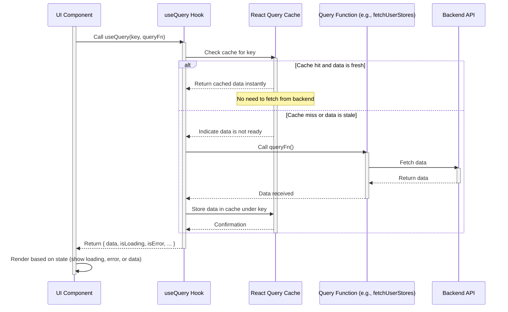

# Chapter 8: React Query Data Management

Welcome back to the Telemora tutorial! In our journey so far, we've connected to Telegram ([Chapter 1: Telegram Mini App Core Integration](01_telegram_mini_app_core_integration_.md)), learned about the user ([Chapter 2: User Domain Logic](02_user_domain_logic_.md)), managed stores ([Chapter 3: Store Domain Logic](03_store_domain_logic_.md)), handled products ([Chapter 4: Product Domain Logic](04_product_domain_logic_.md)), processed orders ([Chapter 5: Order Domain Logic](05_order_domain_logic_.md)), and integrated payments ([Chapter 6: Payment Integration (TON Connect)](06_payment_integration__ton_connect__.md)). We've also seen how these pieces fit into the application's overall structure and how users navigate it ([Chapter 7: UI Layouts and Navigation](07_ui_layouts_and_navigation_.md)).

Now, let's talk about the glue that holds much of this together, especially when dealing with data that comes from our backend API. Getting data from a server, showing a loading spinner, displaying errors if something goes wrong, and making sure the data stays up-to-date is a common task in web development. Doing this manually in React components can quickly become complicated, leading to a lot of repetitive code and state management issues.

This is where **React Query Data Management**, powered by the TanStack Query library (often still called React Query), steps in. It's a powerful tool designed specifically to manage server-side data in your React application.

Think of React Query as a smart data assistant for your app. Instead of your components directly asking the server for data and having to worry about *when* to ask, *where* to store the data, *what* to do while waiting, and *how* to react if the data changes elsewhere, you tell React Query *what* data you need. It takes care of all the hard parts for you:

* **Fetching:** It automatically fetches data when your component needs it.
* **Caching:** It remembers the data it fetched so it can instantly show it if you ask for it again, even if you navigate away and come back. This makes your app feel faster.
* **Synchronization:** It can automatically refetch data in the background to keep it fresh, like when a user focuses the browser window or when you perform an action that might change that data (like creating a new item).
* **State Management:** It provides simple hooks that tell you whether data is loading (`isLoading`), if there was an error (`isError`), and gives you the actual data (`data`) when it's ready.

It dramatically simplifies the code needed to display and interact with data from your API.

## The Core Use Case: Fetching and Displaying a List of Stores

Let's revisit a use case from [Chapter 3: Store Domain Logic](03_store_domain_logic_.md): displaying a list of the current user's stores on their Stores page.

Manually doing this would involve:

1. Adding state for `stores`, `isLoading`, `error` in the component.
2. Using `useEffect` to call the API function (`fetchUserStores`) when the component mounts.
3. Setting `isLoading` to `true` before the fetch.
4. Updating `stores` state with the fetched data on success.
5. Setting `isLoading` to `false` and handling errors on failure.
6. Adding logic to potentially re-fetch if needed.

With React Query, this becomes much simpler.

## Key Concepts in React Query

Let's break down the main ideas:

### 1. Queries (`useQuery`)

A "query" is simply a request to *fetch* data. In React Query, you define a query using the `useQuery` hook.

The `useQuery` hook takes two main things:

* A **Query Key**: A unique identifier for the data you want to fetch. This is usually an array. React Query uses this key to manage the cache for this specific piece of data.
* A **Query Function (`queryFn`)**: An asynchronous JavaScript function that performs the actual data fetching (like calling your API function).

When your component calls `useQuery`, React Query checks its cache using the **Query Key**.

* If the data exists and is "fresh" (not stale), it instantly returns the cached data.
* If the data is missing or "stale", it calls your **Query Function** to fetch the latest data.

It then automatically manages the `isLoading`, `isError`, and `data` states and updates your component when the data is ready or changes.

### 2. Query Keys

Query keys are crucial. They are how React Query identifies pieces of data in its cache. They should be unique for different data.

A query key is typically an array.

* For a list of something (like all user orders), the key might be simple: `['orders', 'my']`.
* For a specific item (like details for order ID 123), the key should include the identifier: `['orders', 'detail', 123]`.
* For data that depends on parameters (like products for store ID 456), the key includes the parameters: `['products', 'store', 456]`.

Telemora uses a centralized place for query keys in `src/libs/common/api/query-keys.ts` to keep them organized and consistent:

```typescript
// src/libs/common/api/query-keys.ts (Simplified)
export const queryKeys = {
  orders: {
    all: ['orders', 'my'] as const, // Key for all user orders
    detail: (id: string | number) => ['orders', 'detail', id] as const, // Key for a specific order
  },
  stores: {
    my: ['stores', 'my'] as const, // Key for all user stores
    detail: (id: string | number) => ['stores', 'detail', id] as const, // Key for a specific store
    // ... other store keys
  },
  products: {
    byStore: (storeId: string | number) => ['products', 'store', storeId] as const, // Key for products in a store
    detail: (storeId: string | number, productId: string | number) =>
      ['products', 'store', storeId, productId] as const, // Key for a specific product
    // ... other product keys
  },
  // ... other domain keys
};
```

Using these central keys (`queryKeys.stores.my`, `queryKeys.products.byStore(storeId)`) makes sure we use the same identifier whenever we refer to the same data, allowing React Query to manage its cache correctly.

### 3. Mutations (`useMutation`)

A "mutation" is a request to *change* data on the server (like creating, updating, or deleting something). Unlike queries, mutations don't usually cache the result in the same way, but they are essential for actions that modify data.

You define a mutation using the `useMutation` hook. It takes a **Mutation Function (`mutationFn`)** which is the asynchronous function that sends the data to the server (e.g., a `POST` or `PATCH` API call).

When you trigger a mutation (by calling the `mutate` function returned by the hook), React Query calls your **Mutation Function** and provides state like `isPending` (while the action is happening) and `isError`.

### 4. Invalidation (`queryClient.invalidateQueries`)

After you successfully perform a mutation (change data on the server), the data that React Query has *cached* via queries might be outdated. For example, if you create a new store, the cached list of "my stores" is now missing the new one.

React Query provides a `queryClient.invalidateQueries` method to tell it that the data associated with a specific query key (or pattern of keys) is now "stale" and should be marked for potential refetching. When a component next tries to use a query with that key, React Query will automatically refetch the data in the background, updating the UI with the latest information. This is a powerful way to keep your UI synchronized with the server after making changes.

## Setting up React Query

To use React Query in your app, you need to wrap your application (or the parts that will use React Query hooks) with the `QueryClientProvider`. This provider holds the cache and configuration for React Query.

In Telemora, this is done in `src/libs/common/context/queryContext.tsx`:

```typescript
// src/libs/common/context/queryContext.tsx
'use client';

import { QueryClient, QueryClientProvider } from '@tanstack/react-query';
import { type PropsWithChildren, useState } from 'react';

// QueryContext component
export function QueryContext({ children }: PropsWithChildren) {
  // Create a new QueryClient instance only once
  const [queryClient] = useState(() => new QueryClient());

  // Provide the queryClient to the rest of the app
  return <QueryClientProvider client={queryClient}>{children}</QueryClientProvider>;
}
```

This component simply creates a `QueryClient` instance and passes it to the `QueryClientProvider`, which then wraps the `children` (the rest of your application).

As seen in [Chapter 1: Telegram Mini App Core Integration](01_telegram_mini_app_core_integration_.md) and [Chapter 7: UI Layouts and Navigation](07_ui_layouts_and_navigation_.md), this `QueryContext` is placed high up in the component tree within the `AppProvider` (`src/providers/AppProvider.tsx`) to make React Query available throughout the app:

```typescript
// src/providers/AppProvider.tsx (Snippet showing QueryContext placement)
'use client';

// ... other imports

// Import QueryContext
import { QueryContext } from '@/libs/common/context/queryContext';
// Import other providers
import { UserProvider } from '@/libs/users/context/userContext';
import TonConnectClientProvider from '@/providers/TonConnectClientProvider';

export function AppProvider({ children }: PropsWithChildren) {
  return (
    <>
      {/* ... InitTelegram and TonConnectClientProvider */}
       <TonConnectClientProvider>
         {/* QueryContext wraps parts that need data fetching/mutations */}
         <QueryContext>
           {/* UserProvider often needs query data, so it's inside */}
           <UserProvider>{children}</UserProvider>
         </QueryContext>
       </TonConnectClientProvider>
      {/* ... rest of the AppProvider */}
    </>
  );
}
```

This ensures that any component rendered within `AppProvider` can use React Query hooks.

## Using React Query for Fetching Data (Example: User Stores)

Let's see how a component would use `useUserStoresQuery` (from [Chapter 3: Store Domain Logic](03_store_domain_logic_.md)) which is built with React Query.

The `useUserStoresQuery` hook itself is defined in `src/libs/stores/hooks/index.ts`:

```typescript
// src/libs/stores/hooks/index.ts (Simplified useUserStoresQuery)
import { useQuery } from '@tanstack/react-query';
import { queryKeys } from '@/libs/common/api/query-keys'; // Our query keys
import { fetchUserStores } from '@/libs/stores/api'; // The API function
import { StoreSummary } from '@/libs/stores/types';

// Custom hook to fetch the current user's stores
export function useUserStoresQuery() {
  return useQuery<StoreSummary[]>({
    // Unique key for this query
    queryKey: queryKeys.stores.my,
    // Function that fetches the data
    queryFn: fetchUserStores,
    // Optional: Data is considered fresh for 5 minutes
    staleTime: 1000 * 60 * 5,
  });
}
```

Now, a component that wants to display the user's stores can simply call this hook:

```typescript
// Example Component (Conceptual - might be part of a Stores page)
'use client';

import { useUserStoresQuery } from '@/libs/stores/hooks';
// ... import UI components for displaying stores

function UserStoresList() {
  // Call the React Query hook
  const { data: stores, isLoading, isError, error } = useUserStoresQuery();

  // Handle loading state
  if (isLoading) {
    return <div>Loading your stores...</div>;
  }

  // Handle error state
  if (isError) {
    console.error('Failed to load stores:', error);
    return <div>Error loading stores: {error.message}</div>;
  }

  // Once data is loaded and no error, render the list
  return (
    <div>
      <h2>My Stores</h2>
      {stores.length === 0 ? (
        <p>You don't have any stores yet.</p>
      ) : (
        // Map over the stores data and render a card for each
        <div className="grid grid-cols-1 gap-4">
          {stores.map((store) => (
             // Assuming StoreSummaryCard takes StoreSummary data
             // Example from Chapter 3, often receives props, but could use hook too
             <div key={store.id}>Store: {store.name}</div>
          ))}
        </div>
      )}
    </div>
  );
}
```

See how simple this component is? It just calls `useUserStoresQuery()` and gets back the `data`, `isLoading`, and `isError` states. It doesn't need to worry about `useEffect`, setting up manual state, or handling cache. React Query does all of that behind the scenes.

## Conceptual Flow: Fetching Data with React Query

Here's a simplified look at how `useQuery` works:



The component asks the `useQuery` hook for data using a key. The hook checks the cache. If the data is there and fresh, it's returned immediately. Otherwise, the hook calls the provided `queryFn` to fetch data from the backend, stores it in the cache once received, and then provides it to the component.

## Using React Query for Updating Data (Example: Creating a Store)

Now let's look at mutations and invalidation, using the `useCreateStoreMutation` hook from [Chapter 3: Store Domain Logic](03_store_domain_logic_.md). This hook is used when a seller creates a new store.

The `useCreateStoreMutation` hook is defined in `src/libs/stores/hooks/index.ts`:

```typescript
// src/libs/stores/hooks/index.ts (Simplified useCreateStoreMutation)
import { useMutation, useQueryClient } from '@tanstack/react-query';
import { queryKeys } from '@/libs/common/api/query-keys'; // Our query keys
import { submitStoreBasicInfo } from '@/libs/stores/api'; // The API function
import { CreateStoreBasicDto } from '@/libs/stores/schemas';
import { StoreDetail } from '@/libs/stores/types';

// Custom hook to create a new store
export function useSubmitStoreBasicInfoMutation() {
  // Get access to the QueryClient instance
  const queryClient = useQueryClient();

  return useMutation<StoreDetail, Error, CreateStoreBasicDto>({
    // The function that sends data to the backend
    mutationFn: (data) => submitStoreBasicInfo(data),
    // This function runs after a successful mutation
    onSuccess: async () => {
      // Invalidate the 'my stores' query cache
      // This tells React Query that the cached list of user stores
      // is potentially outdated and should be refetched the next
      // time a component asks for it.
      await queryClient.invalidateQueries({ queryKey: queryKeys.stores.my });
      // await queryClient.prefetchQuery({ queryKey: queryKeys.stores.my, queryFn: fetchUserStores }); // Optional: aggressively refetch now
    },
  });
}
```

A component with a form to create a store would use this hook like this:

```typescript
// Example Create Store Component (Conceptual Form)
'use client';

import { useSubmitStoreBasicInfoMutation } from '@/libs/stores/hooks';
// ... import form management, validation, UI components

function CreateStoreForm() {
  // Get the mutation function and state
  const { mutate: createStore, isPending, isError, error } = useSubmitStoreBasicInfoMutation();

  // Assume formData is collected from a form
  const formData = { name: 'New Awesome Store', walletAddress: '...' };

  const handleSubmit = () => {
    // Trigger the mutation with form data
    createStore(formData, {
      onSuccess: () => {
        console.log('Store created successfully!');
        // The onSuccess in the hook will invalidate the cache
        // This local onSuccess can handle UI feedback (e.g., redirect, show toast)
        alert('Store created!'); // Simple alert example
      },
      onError: (err) => {
        console.error('Failed to create store:', err);
        alert('Failed to create store.'); // Simple alert example
      },
    });
  };

  return (
    <div>
      <h2>Create New Store</h2>
      {/* ... form fields */}
      <button onClick={handleSubmit} disabled={isPending}>
        {isPending ? 'Creating...' : 'Create Store'}
      </button>
      {isError && <div>Error: {error.message}</div>}
    </div>
  );
}
```

When the "Create Store" button is clicked, `createStore(formData, ...)` is called. This triggers the `mutationFn` in the hook, sending the data to the backend. While this is happening, `isPending` is true, disabling the button. If successful, the `onSuccess` callback in the hook runs, calling `queryClient.invalidateQueries({ queryKey: queryKeys.stores.my })`. This marks the cached data for `useUserStoresQuery` as stale. The next time the Stores page (or any component using `useUserStoresQuery`) needs the data, it will perform a background refetch, getting the latest list *including* the new store.

## Conceptual Flow: Mutation and Invalidation with React Query

Here's a simplified look at how `useMutation` and `invalidateQueries` work together:

```mermaid
sequenceDiagram
    participant Component as UI Component (e.g., Create Store Form)
    participant UseMutationHook as useMutation Hook
    participant MutationFn as Mutation Function (e.g., submitStoreBasicInfo)
    participant Backend as Backend API
    participant ReactQuery as React Query Cache
    participant QueryClient as QueryClient Instance
    participant UseQueryHook as useQuery Hook (e.g., useUserStoresQuery)
    participant StaleQuery as Stale Data for Key

    activate Component
    Component->>UseMutationHook: Call mutate(data)
    activate UseMutationHook
    UseMutationHook->>MutationFn: Call mutationFn(data)
    activate MutationFn
    MutationFn->>Backend: Send data (POST/PATCH/DELETE)
    activate Backend
    Backend-->>MutationFn: Return success/failure
    deactivate Backend
    MutationFn-->>UseMutationHook: Result received
    deactivate MutationFn

    alt Mutation Successful
        UseMutationHook->>QueryClient: Access QueryClient
        activate QueryClient
        QueryClient->>ReactQuery: invalidateQueries(key)
        ReactQuery->>StaleQuery: Mark data for key as stale
        deactivate QueryClient
        UseMutationHook-->>Component: Mutation success state ({ isPending: false, data: ... })
        Note over Component: onSuccess handler triggered
    else Mutation Failed
        UseMutationHook-->>Component: Mutation failure state ({ isPending: false, error: ... })
        Note over Component: onError handler triggered
    end
    deactivate UseMutationHook

    Note over UserQueryHook: useQuery hook is already running for the key

    alt Stale data exists and is needed again
        UseQueryHook->>ReactQuery: Data for key requested/needed
        activate ReactQuery
        ReactQuery-->>UseQueryHook: Returns stale data immediately (if configured)
        ReactQuery->>QueryFn: Trigger background refetch (because data is stale)
        activate QueryFn
        QueryFn->>Backend: Fetch fresh data
        activate Backend
        Backend-->>QueryFn: Return fresh data
        deactivate Backend
        QueryFn-->>ReactQuery: Store fresh data in cache
        ReactQuery-->>UseQueryHook: Fresh data available
        deactivate QueryFn
        deactivate ReactQuery
        UseQueryHook-->>Component: Update with fresh data
    end
    deactivate UseQueryHook
    deactivate Component
```

When the component triggers a mutation, the `useMutation` hook sends the data to the backend via the `mutationFn`. If successful, the `onSuccess` handler within the hook (or optionally the component's `onSuccess`) uses the `queryClient` to tell React Query to mark the data for a specific key (`['stores', 'my']` in this example) as stale in the cache. The `useQuery` hook for that same key (which might be running on the Stores page) sees that its cached data is stale and automatically performs a background refetch to get the updated list of stores from the backend.

## Benefits of Using React Query

Using React Query (TanStack Query) provides significant benefits:

* **Simplified Data Fetching:** Reduces boilerplate code for managing loading, error, and data states.
* **Automatic Caching:** Improves application performance and responsiveness by storing and serving data locally.
* **Background Refetching:** Keeps UI data fresh with minimal effort.
* **DevTools:** Provides excellent browser developer tools to inspect cache, queries, and mutations, aiding debugging.
* **Optimistic Updates:** (More advanced) Allows you to update the UI *before* the server responds to a mutation, making the app feel faster (Telemora might use this in some places).
* **Reduced Network Requests:** Avoids unnecessary fetching by leveraging the cache and intelligent background updates.

Almost all data fetching and modification interactions with the backend API in Telemora are managed by React Query hooks (`useQuery` and `useMutation`) within each domain logic group ([Chapter 2-6]). This centralization and standardization make the codebase cleaner, more predictable, and easier to maintain.

## Conclusion

In this chapter, we explored how **React Query Data Management** simplifies working with server data in the Telemora web application. We learned how `useQuery` is used for fetching data, identified the importance of query keys for caching, and understood how the hook manages loading and error states. We also saw how `useMutation` is used for sending data to the server to create, update, or delete resources, and crucially, how `queryClient.invalidateQueries` helps keep the client-side cache synchronized with the server after a mutation, automatically triggering background refetches. Finally, we saw the role of the `QueryClientProvider` in enabling React Query throughout the application.

By leveraging React Query, Telemora minimizes complex manual state management for server data, leading to a more robust, performant, and developer-friendly application.

Now that we understand how data fetching and management work at a higher level using React Query, let's look at the fundamental utility that handles the actual sending and receiving of HTTP requests to our backend. In the [next chapter](09_http_client_utility_.md), we will dive into the **HTTP Client Utility**.

[Next Chapter: HTTP Client Utility](09_http_client_utility_.md)

---
