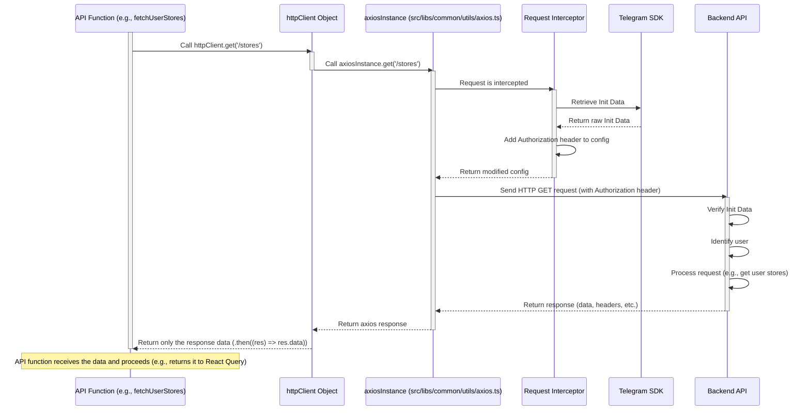

# Chapter 9: HTTP Client Utility

Welcome to the final chapter of the Telemora tutorial! In our journey through the application, we've explored integrating with Telegram ([Chapter 1: Telegram Mini App Core Integration](01_telegram_mini_app_core_integration_.md)), managing various parts of our marketplace like users ([Chapter 2: User Domain Logic](02_user_domain_logic_.md)), stores ([Chapter 3: Store Domain Logic](03_store_domain_logic_.md)), products ([Chapter 4: Product Domain Logic](04_product_domain_logic_.md)), orders ([Chapter 5: Order Domain Logic](05_order_domain_logic_.md)), and payments ([Chapter 6: Payment Integration (TON Connect)](06_payment_integration__ton_connect__.md)). We also learned how the user interface is structured ([Chapter 7: UI Layouts and Navigation](07_ui_layouts_and_navigation_.md)) and how **React Query Data Management** ([Chapter 8: React Query Data Management](08_react_query_data_management_.md)) simplifies fetching and updating data from our backend API.

While React Query is fantastic at *managing* the state of our server data (loading, caching, re-fetching), it still needs a tool to perform the actual communication with the backend API. This communication happens over the internet using the **HTTP** protocol (Hypertext Transfer Protocol). Every time our app needs to get information (a GET request) or send information (a POST, PATCH, or DELETE request) to our backend, it uses HTTP.

Making raw HTTP requests directly every time in different parts of the application can be tedious and repetitive. For example, you might need to set the base URL for the API, add specific headers for authentication, or handle potential network errors in a consistent way.

This is where the **HTTP Client Utility** comes in. It's a dedicated tool in our project whose sole job is to simplify making these HTTP requests to our backend API. Think of it as the application's standard "mailroom" for sending and receiving data messages to and from the server.

## What Problem Does it Solve?

Imagine you have dozens of different API functions across your application (like `fetchUserStores`, `getProductDetails`, `createOrder`, etc., which we saw in Chapters 2-6). If each of these functions had to manually set up how to send an HTTP request (specifying the method, URL, headers, body, error handling), the code would be very repetitive and hard to maintain.

The HTTP Client Utility solves this by providing a single, consistent way to make these requests. It acts as a wrapper around a popular JavaScript library called **`axios`**, which is excellent for making HTTP requests.

Furthermore, for a Telegram Mini App, there's a critical requirement: every request to the backend usually needs to include the **Telegram Init Data** in the headers. This Init Data acts as proof that the request is coming from a legitimate Telegram user and allows the backend to identify who is making the request. Manually adding this header to *every single API call* would be extremely annoying and error-prone. The HTTP Client Utility handles this automatically!

## The Core Use Case: Making Any API Call

The core use case for the HTTP Client Utility isn't tied to a single feature like "displaying user stores". Instead, its use case is fundamental to *every* interaction with the backend API. Any API function, regardless of which domain logic it belongs to (User, Store, Product, etc.), will use this utility to send its HTTP request.

For example, when the `fetchUserStores` API function (from [Chapter 3: Store Domain Logic](03_store_domain_logic_.md)) needs to get the list of stores, it doesn't build the raw HTTP request itself; it asks the `httpClient` utility to do it.

## Key Concepts: `httpClient` and Auto-Auth

There are two main concepts related to this utility:

1. **The `httpClient` Object:** This is the primary object you interact with. It provides simple methods like `get()`, `post()`, `patch()`, `delete()` that mirror standard HTTP methods.
2. **Automatic Telegram Init Data Header:** The utility is configured to automatically retrieve the Telegram Init Data and add it as an `Authorization` header (`tma <initData>`) to *every* outgoing request.

Let's look at how API functions use the `httpClient`. Here are simplified examples from previous chapters:

**Example 1: Fetching User Stores ([Chapter 3: Store Domain Logic](03_store_domain_logic_.md))**

```typescript
// src/libs/stores/api/index.ts (Simplified)
import httpClient from '@/libs/common/utils/http-client';
import {StoreSummary} from '@/libs/stores/types';

export async function fetchUserStores() {
  // Use httpClient's get method to fetch data from the '/stores' endpoint
  // httpClient automatically adds the base URL and auth header
  return httpClient.get<StoreSummary[]>('/stores');
}
```

**Example 2: Creating a Product ([Chapter 4: Product Domain Logic](04_product_domain_logic_.md))**

```typescript
// src/libs/products/api/index.ts (Simplified)
import httpClient from '@/libs/common/utils/http-client';
import {CreateProductDto, ProductDetail} from '@/libs/products/types';

export async function createProduct(storeId: number, data: CreateProductDto) {
  // Use httpClient's post method to send data to the backend
  // httpClient automatically adds the base URL, auth header, and sets Content-Type
  return httpClient.post<ProductDetail>(`/products/store/${storeId}/create`, data);
}
```

In both examples, the API functions don't worry about the low-level HTTP details. They simply call `httpClient.get` or `httpClient.post`, providing the specific endpoint path and the data (for POST). The `httpClient` utility takes care of everything else, including adding the necessary Telegram authentication header.

## How It's Implemented Under the Hood

The HTTP Client Utility is built using the `axios` library and involves two main files:

1. **`src/libs/common/utils/axios.ts`**: This file creates and configures the core `axios` instance.
2. **`src/libs/common/utils/http-client.ts`**: This file wraps the configured `axios` instance with simpler methods and adds a little convenience.

Let's look at `src/libs/common/utils/axios.ts`:

```typescript
// src/libs/common/utils/axios.ts
import {retrieveRawInitData} from '@telegram-apps/sdk-react'; // To get Telegram Init Data
import axios from 'axios'; // The core axios library

// Create an axios instance with base configuration
const axiosInstance = axios.create({
  // Set the base URL for all requests from environment variables
  baseURL: process.env.NEXT_PUBLIC_API_URL,
  headers: {
    // Set a default Content-Type header for JSON data
    'Content-Type': 'application/json',
  },
});

// Add a request interceptor
axiosInstance.interceptors.request.use((config) => {
  // This function runs BEFORE each request is sent

  // Check if we are running in a browser environment (where window exists)
  if (typeof window !== 'undefined') {
    // Retrieve the raw Telegram Init Data
    const rawInitData = retrieveRawInitData();
    // If Init Data is available
    if (rawInitData) {
      // Add the Authorization header in the "tma <initData>" format
      config.headers['Authorization'] = `tma ${rawInitData}`;
    }
  }
  // Return the modified configuration for the request to proceed
  return config;
});

export default axiosInstance;
```

This file is the heart of the automatic authentication.

* `axios.create(...)` creates a customized instance of axios. We set the `baseURL` here, which is read from the application's environment variables (`process.env.NEXT_PUBLIC_API_URL`). This means all API functions only need to provide the path relative to this base URL (e.g., `/users/login`, `/stores`). We also set a default `Content-Type` header.
* `axiosInstance.interceptors.request.use(...)` adds a **request interceptor**. An interceptor is a function that axios runs automatically *before* sending a request. Our interceptor function takes the request `config` as input, modifies it, and returns it.
* Inside the interceptor, we check `if (typeof window !== 'undefined')` because Telegram Mini Apps run in a browser-like environment where the `window` object exists, but this code might also be processed during server-side rendering (SSR) where `window` is not available. We only want to access Telegram SDK features on the client side.
* `retrieveRawInitData()` is a helper from the `@telegram-apps/sdk-react` library ([Chapter 1: Telegram Mini App Core Integration](01_telegram_mini_app_core_integration_.md)) that gets the cryptographically signed Telegram Init Data string.
* If `rawInitData` is found, we add or update the `Authorization` header in the request config. The format `tma <initData>` is a convention (like `Bearer <token>`) used by our backend to identify and verify requests from Telegram Mini Apps.

This interceptor ensures that *every* request made through `axiosInstance` automatically gets the correct Telegram authentication header attached *before* it's sent over the network.

Now, let's look at `src/libs/common/utils/http-client.ts`:

```typescript
// src/libs/common/utils/http-client.ts
import {AxiosRequestConfig} from 'axios'; // Type definition for config

import axios from './axios'; // Import our configured axios instance

// Create a simple wrapper object
export const httpClient = {
  // Wrap axiosInstance.get
  get: <T>(url: string, config?: AxiosRequestConfig<unknown>) =>
    // Call the axios get method and immediately return the .data property
    axios.get<T>(url, config).then((res) => res.data),

  // Wrap axiosInstance.post
  post: <T>(url: string, data?: unknown, config?: AxiosRequestConfig<unknown>) =>
    axios.post<T>(url, data, config).then((res) => res.data),

  // Wrap axiosInstance.patch
  patch: <T>(url: string, data?: unknown, config?: AxiosRequestConfig<unknown>) =>
    axios.patch<T>(url, data, config).then((res) => res.data),

  // Wrap axiosInstance.put
  put: <T>(url: string, data?: unknown, config?: AxiosRequestConfig<unknown>) =>
    axios.put<T>(url, data, config).then((res) => res.data),

  // Wrap axiosInstance.delete
  delete: <T>(url: string, config?: AxiosRequestConfig<unknown>) =>
    axios.delete<T>(url, config).then((res) => res.data),
};

export default httpClient;
```

This file is simpler. It imports the configured `axiosInstance` from the previous file. It then exports an object `httpClient` that has methods (`get`, `post`, etc.) that call the corresponding methods on `axiosInstance`. The `.then((res) => res.data)` part is a small convenience – axios responses normally return an object with headers, status code, *and* the data. By adding `.then((res) => res.data)`, our `httpClient` methods return *only* the actual data received from the backend, which is usually what our API functions need.

## Conceptual Flow: Request with Auto-Auth Header

Here's how a simple GET request flows through the `httpClient` utility:



This diagram shows that the API function calls `httpClient`, which calls the configured `axiosInstance`. Before sending, the request hits the interceptor. The interceptor gets the Init Data from the Telegram SDK, adds the auth header, and allows the request to proceed. Axios sends the request to the backend. The backend uses the header to authenticate and identify the user, processes the request, and sends the response back. `httpClient` extracts just the data from the response before returning it to the API function.

## Benefits of the HTTP Client Utility

Using this utility provides several advantages:

* **Consistency:** All API calls are made in the same way (`httpClient.get`, `httpClient.post`, etc.).
* **Centralized Configuration:** The backend `baseURL` and default headers are set in one place.
* **Automatic Authentication:** The crucial Telegram Init Data header is added automatically to *every* request without any extra code in API functions. This is arguably the biggest benefit for a Telegram Mini App.
* **Simplified API Functions:** API functions only focus on the specific endpoint and data, not the low-level HTTP mechanics.
* **Easier Updates:** If you need to change headers, base URL, or add other request logic, you do it in the central `axios.ts` file, and it applies to all API calls automatically.

Every API function you've seen in Chapters 2 through 6 (and others like Location, Reviews, etc.) relies on this `httpClient` to perform its network requests. It's the invisible but essential layer that connects our frontend application logic to the backend server.

## Conclusion

In this final chapter, we explored the **HTTP Client Utility**, understanding its role as the application's standard tool for making HTTP requests to the backend API. We learned that it's built on top of the `axios` library and, crucially, automatically handles adding the Telegram Init Data to request headers for authentication. We saw how the `axios.create` configuration and a request interceptor in `src/libs/common/utils/axios.ts` enable this automatic behavior, and how `src/libs/common/utils/http-client.ts` provides a convenient wrapper around the configured axios instance.

By centralizing and standardizing backend communication and automating the authentication header, the HTTP Client Utility keeps our API functions clean, simplifies development, and ensures secure and consistent interactions with the server throughout the Telemora web application.

This concludes our tutorial on the key concepts and architecture of the `telemora-web` project. We've covered everything from the foundational Telegram integration to user data, store and product management, orders, payments, UI structure, data management with React Query, and finally, the core HTTP communication layer.

Thank you for joining this journey through the Telemora codebase! Hopefully, this tutorial provides a solid understanding of how the project is structured and how its different parts work together.

---
